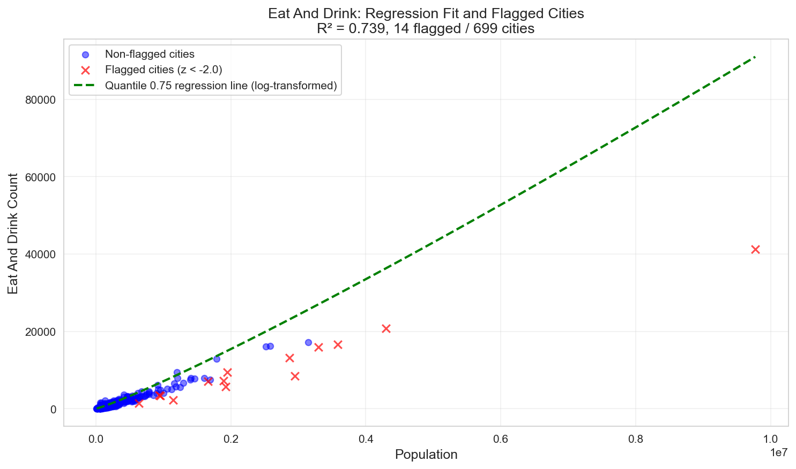
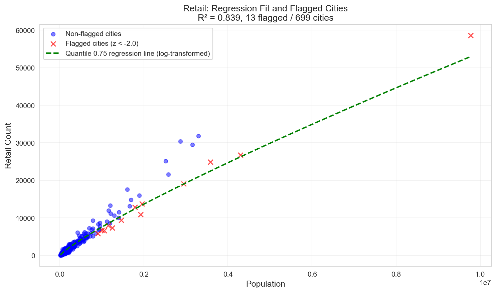
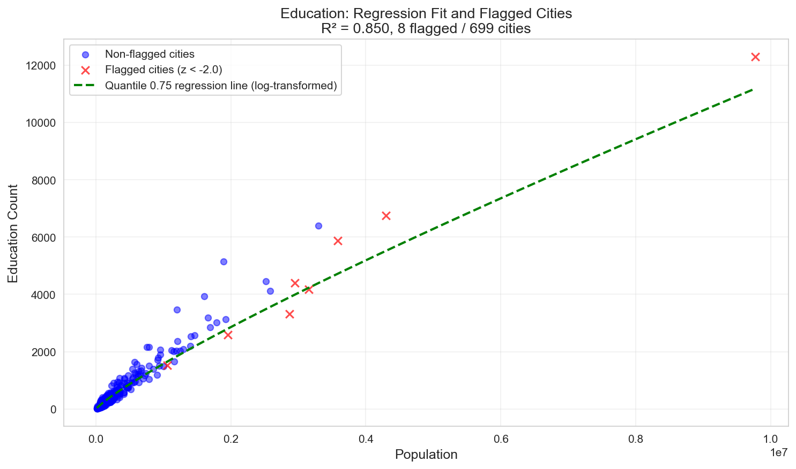
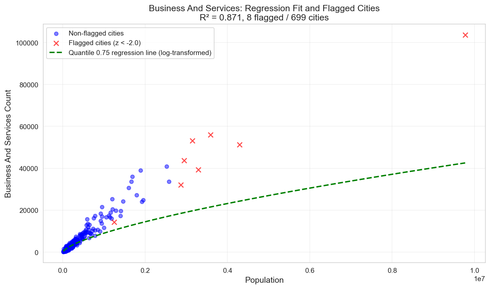

# City-Level Land Use Data Confidence Report

This report provides a comprehensive analysis of data quality for POI (Point of Interest) data across 690 EU cities, using regression-based confidence scoring.

---

## Executive Summary

- **Total cities analyzed**: 699
- **Cities with at least one flagged category**: 26 (3.7%)
- **Mean flagged categories per city**: 0.17
- **Median flagged categories per city**: 0.0
- **Max flagged categories**: 11

## Methodology

Confidence scores are computed using regression analysis to identify cities with unexpectedly low POI counts given their population and area:

1. **Regression type**: Quantile Regression (q=quantile)
2. **Regression models**: For each common land-use category (eat_and_drink, retail, education, etc.), fit regression: `POI_count ~ population + area_km2`
   - **Quantile regression**: Fits to cities with HIGHER POI coverage (above the quantile), not the mean. This defines what 'good coverage' looks like.
   - Cities below this line are more likely to have data quality issues.
3. **Residual analysis**: Compute standardized residuals (z-scores) for each city
4. **Flagging**: Cities with z-scores < -2.0 in a category are flagged as having likely data quality issues
5. **Quality assessment**: Based on number of flagged categories and severity of z-scores

## Regression Model Diagnostics

**Regression Type**: Quantile Regression (q=quantile)

Model fit quality (R²) for each land-use category:

| Land Use Category | R² Score | N Cities | Coef (Population) | Coef (Area) | Intercept |
|-------------------|----------|----------|-------------------|-------------|----------|
| Business And Services | 0.871 | 699 | 6.80e-01 | 0.41 | -1.9 |
| Active Life | 0.831 | 699 | 5.19e-01 | 0.59 | -3.0 |
| Arts And Entertainment | 0.809 | 699 | 7.57e-01 | 0.33 | -5.4 |
| Public Services | 0.756 | 699 | 4.42e-01 | 0.73 | -2.5 |
| Retail | 0.839 | 699 | 8.54e-01 | 0.10 | -3.3 |
| Health And Medical | 0.765 | 699 | 6.54e-01 | 0.45 | -3.5 |
| Eat And Drink | 0.739 | 699 | 1.12e+00 | -0.16 | -6.0 |
| Education | 0.850 | 699 | 8.60e-01 | 0.17 | -5.2 |
| Attractions And Activities | 0.682 | 699 | 5.75e-01 | 0.61 | -4.1 |
| Religious | 0.724 | 699 | 6.72e-01 | 0.34 | -5.0 |
| Accommodation | 0.486 | 699 | 9.37e-01 | 0.17 | -6.9 |

### Regression Fit Visualizations

The following plots show the regression fit for each category. Blue dots represent cities with acceptable POI coverage, while red X marks indicate flagged cities (those significantly below the expected line).

#### Eat And Drink

#### Retail

#### Education

#### Business And Services

*Additional regression plots available in the `regression_plots/` directory.*

## Most Commonly Flagged Categories

Cities with data quality issues by category:

- **Religious**: 17 cities (2.4%)
- **Eat And Drink**: 14 cities (2.0%)
- **Retail**: 13 cities (1.9%)
- **Public Services**: 13 cities (1.9%)
- **Accommodation**: 12 cities (1.7%)
- **Attractions And Activities**: 10 cities (1.4%)
- **Health And Medical**: 8 cities (1.1%)
- **Education**: 8 cities (1.1%)
- **Business And Services**: 8 cities (1.1%)
- **Arts And Entertainment**: 8 cities (1.1%)
- **Active Life**: 8 cities (1.1%)

## Data Quality Patterns

### Flagged Categories by City Size

| City Size | Mean Flagged Categories | N Cities |
|-----------|-------------------------|----------|
| Small (<100k) | 0.00 | 339 |
| Medium (100k-500k) | 0.00 | 298 |
| Large (>500k) | 1.92 | 62 |

### Flagged Categories by Country

Countries ranked by mean flagged categories (fewer is better):

| Country | Mean Flags | Median Flags | N Cities |
|---------|------------|--------------|----------|
| HU | 0.00 | 0.0 | 14 |
| MT | 0.00 | 0.0 | 1 |
| LV | 0.00 | 0.0 | 3 |
| LU | 0.00 | 0.0 | 1 |
| LT | 0.00 | 0.0 | 4 |
| SI | 0.00 | 0.0 | 2 |
| HR | 0.00 | 0.0 | 5 |
| EE | 0.00 | 0.0 | 3 |
| SK | 0.00 | 0.0 | 7 |
| CH | 0.00 | 0.0 | 20 |
| BE | 0.00 | 0.0 | 16 |
| DK | 0.00 | 0.0 | 4 |
| CZ | 0.00 | 0.0 | 16 |
| CY | 0.00 | 0.0 | 3 |
| NL | 0.02 | 0.0 | 51 |
| BG | 0.08 | 0.0 | 13 |
| ES | 0.08 | 0.0 | 111 |
| SE | 0.12 | 0.0 | 16 |
| RO | 0.16 | 0.0 | 32 |
| IT | 0.20 | 0.0 | 87 |
| FR | 0.22 | 0.0 | 76 |
| PL | 0.26 | 0.0 | 54 |
| DE | 0.26 | 0.0 | 110 |
| NO | 0.33 | 0.0 | 3 |
| PT | 0.42 | 0.0 | 12 |
| GR | 0.46 | 0.0 | 13 |
| AT | 0.50 | 0.0 | 8 |
| IE | 0.80 | 0.0 | 5 |
| FI | 1.00 | 0.0 | 4 |

**Summary:**

- **Cities with country data**: 694 (99.3%)
- **Number of countries**: 29
- **Countries with mean confidence < 0.5**: 26
  - HU: 0.000 (n=14)
  - MT: 0.000 (n=1)
  - LV: 0.000 (n=3)
  - LU: 0.000 (n=1)
  - LT: 0.000 (n=4)
  - SI: 0.000 (n=2)
  - HR: 0.000 (n=5)
  - EE: 0.000 (n=3)
  - SK: 0.000 (n=7)
  - CH: 0.000 (n=20)
  - BE: 0.000 (n=16)
  - DK: 0.000 (n=4)
  - CZ: 0.000 (n=16)
  - CY: 0.000 (n=3)
  - NL: 0.020 (n=51)
  - BG: 0.077 (n=13)
  - ES: 0.081 (n=111)
  - SE: 0.125 (n=16)
  - RO: 0.156 (n=32)
  - IT: 0.195 (n=87)
  - FR: 0.224 (n=76)
  - PL: 0.259 (n=54)
  - DE: 0.264 (n=110)
  - NO: 0.333 (n=3)
  - PT: 0.417 (n=12)
  - GR: 0.462 (n=13)

### Cities with Labels

- **Cities with geographic labels**: 694 (99.3%)
- **Mean flagged categories (labeled cities)**: 0.17
- **Mean flagged categories (unlabeled cities)**: 0.00

## Top 50 Cities with Fewest Flagged Categories

Cities with best data quality (fewest flagged categories):

| Rank | Bounds FID | City Label | Population | Area (km²) | N Flags | Mean Z-Score | Flagged Categories |
|------|------------|------------|------------|------------|---------|--------------|-------------------|
| 1 | 0 | N/A | 97,244 | 62.8 | 0 | -0.11 | None |
| 2 | 458 | Pavia | 66,257 | 36.8 | 0 | 0.14 | None |
| 3 | 459 | Cremona | 63,416 | 30.8 | 0 | 0.07 | None |
| 4 | 460 | Добрич | 72,154 | 30.6 | 0 | -0.22 | None |
| 5 | 461 | Ferrol | 92,683 | 42.5 | 0 | -0.11 | None |
| 6 | 462 | Русе | 119,719 | 41.7 | 0 | -0.20 | None |
| 7 | 463 | Valence | 94,635 | 50.9 | 0 | -0.04 | None |
| 8 | 464 | Piacenza | 94,079 | 39.0 | 0 | 0.06 | None |
| 9 | 465 | Torino | 1,161,395 | 270.2 | 0 | -0.39 | None |
| 10 | 466 | A Coruña | 298,793 | 78.9 | 0 | -0.17 | None |
| 11 | 467 | Asti | 60,503 | 26.8 | 0 | 0.05 | None |
| 12 | 468 | Alessandria | 65,425 | 28.5 | 0 | 0.05 | None |
| 13 | 469 | Ferrara | 99,971 | 60.4 | 0 | 0.13 | None |
| 14 | 470 | Parma | 157,498 | 56.0 | 0 | 0.15 | None |
| 15 | 471 | Carpi | 60,323 | 35.6 | 0 | -0.04 | None |
| 16 | 472 | Avilés | 90,389 | 34.3 | 0 | -0.13 | None |
| 17 | 473 | Варна | 271,373 | 67.9 | 0 | -0.27 | None |
| 18 | 474 | Gijón / Xixón | 252,852 | 46.2 | 0 | -0.11 | None |
| 19 | 457 | Mofleni | 230,768 | 67.3 | 0 | -0.51 | None |
| 20 | 456 | Grenoble | 348,749 | 109.1 | 0 | -0.41 | None |
| 21 | 454 | Vigevano | 60,432 | 35.1 | 0 | -0.07 | None |
| 22 | 452 | Padova | 261,786 | 119.8 | 0 | 0.19 | None |
| 23 | 433 | Lyon | 57,850 | 33.8 | 0 | -0.18 | None |
| 24 | 434 | Trieste | 186,833 | 62.0 | 0 | 0.08 | None |
| 25 | 435 | Treviso | 85,582 | 42.0 | 0 | 0.11 | None |
| 26 | 436 | Bergamo | 353,630 | 192.8 | 0 | -0.37 | None |
| 27 | 437 | Gallarate | 130,471 | 79.5 | 0 | -0.26 | None |
| 28 | 438 | Chambéry | 102,812 | 56.3 | 0 | -0.13 | None |
| 29 | 439 | Călărași | 57,633 | 31.5 | 0 | -0.20 | None |
| 30 | 441 | Saint-Étienne | 196,196 | 74.9 | 0 | -0.26 | None |
| 31 | 475 | Reggio Emilia | 123,556 | 54.0 | 0 | 0.05 | None |
| 32 | 442 | Busto Arsizio | 312,493 | 154.7 | 0 | -0.62 | None |
| 33 | 444 | Brescia | 241,357 | 123.8 | 0 | 0.01 | None |
| 34 | 445 | Venezia | 180,900 | 69.0 | 0 | -0.12 | None |
| 35 | 446 | Novara | 94,759 | 43.0 | 0 | -0.03 | None |
| 36 | 447 | Verona | 202,774 | 71.5 | 0 | 0.43 | None |
| 37 | 448 | Rijeka | 116,764 | 60.9 | 0 | -0.10 | None |
| 38 | 449 | Venezia | 66,715 | 58.2 | 0 | 1.04 | None |
| 39 | 450 | Slatina | 62,526 | 25.8 | 0 | -0.14 | None |
| 40 | 451 | Magheru | 72,947 | 27.9 | 0 | -0.20 | None |
| 41 | 443 | Vicenza | 100,820 | 52.6 | 0 | 0.10 | None |
| 42 | 432 | Como | 143,976 | 87.3 | 0 | 0.02 | None |
| 43 | 476 | Шумен | 62,787 | 35.6 | 0 | -0.16 | None |
| 44 | 478 | Oviedo | 210,156 | 47.1 | 0 | -0.02 | None |
| 45 | 501 | Vigo | 270,064 | 60.4 | 0 | -0.12 | None |
| 46 | 502 | Pesaro | 69,005 | 31.6 | 0 | 0.10 | None |
| 47 | 504 | El Bierzo | 58,062 | 30.4 | 0 | -0.03 | None |
| 48 | 505 | Ourense | 110,291 | 36.8 | 0 | -0.03 | None |
| 49 | 506 | Prato | 209,792 | 91.6 | 0 | -0.17 | None |
| 50 | 507 | Pau | 119,986 | 54.5 | 0 | -0.09 | None |

## Bottom 50 Cities with Most Flagged Categories

Cities with likely data quality issues (most flagged categories):

| Rank | Bounds FID | City Label | Population | Area (km²) | N Flags | Flagged Categories |
|------|------------|------------|------------|------------|---------|-------------------|
| 1 | 170 | Innenstadt West | 2,946,855 | 1199.3 | 11 | business_and_services, active_life, arts_and_entertainmen... |
| 2 | 307 | Palaiseau | 9,773,324 | 1835.9 | 11 | business_and_services, active_life, arts_and_entertainmen... |
| 3 | 100 | Mitte | 3,585,837 | 837.3 | 10 | business_and_services, active_life, arts_and_entertainmen... |
| 4 | 453 | Milano | 3,150,317 | 850.9 | 9 | business_and_services, active_life, arts_and_entertainmen... |
| 5 | 237 | Katowice | 1,148,965 | 448.9 | 9 | active_life, arts_and_entertainment, public_services, ret... |
| 6 | 601 | Madrid | 4,295,641 | 534.5 | 9 | business_and_services, active_life, public_services, reta... |
| 7 | 618 | Napoli | 2,866,122 | 781.6 | 8 | business_and_services, active_life, arts_and_entertainmen... |
| 8 | 653 | Άστυ Αιγυπτιωτών | 3,296,155 | 505.2 | 6 | business_and_services, public_services, eat_and_drink, at... |
| 9 | 440 | Sector 1 | 1,922,595 | 343.9 | 5 | public_services, retail, eat_and_drink, religious, accomm... |
| 10 | 624 | Cascais e Estoril | 1,791,314 | 468.8 | 5 | active_life, arts_and_entertainment, public_services, ret... |
| 11 | 92 | Warszawa | 1,889,245 | 457.3 | 4 | arts_and_entertainment, eat_and_drink, religious, accommo... |
| 12 | 337 | Mödling | 1,950,842 | 355.8 | 4 | retail, eat_and_drink, education, accommodation |
| 13 | 7 | Helsinki | 1,056,200 | 464.9 | 4 | retail, health_and_medical, education, religious |
| 14 | 346 | Schwabing-Freimann | 1,663,971 | 435.1 | 4 | public_services, eat_and_drink, attractions_and_activitie... |
| 15 | 65 | Hamburg-Mitte | 1,693,378 | 532.5 | 4 | public_services, attractions_and_activities, religious, a... |
| 16 | 51 | Dublin | 1,246,189 | 479.3 | 4 | business_and_services, public_services, retail, health_an... |
| 17 | 15 | Sjöberg | 1,462,756 | 480.8 | 2 | retail, religious |
| 18 | 221 | Lille | 999,401 | 322.9 | 2 | retail, religious |
| 19 | 455 | Bordeaux | 738,916 | 268.3 | 1 | religious |
| 20 | 128 | Łódź | 633,748 | 177.1 | 1 | eat_and_drink |
| 21 | 138 | Rotterdam | 941,436 | 267.7 | 1 | eat_and_drink |
| 22 | 524 | София | 1,121,633 | 226.8 | 1 | religious |
| 23 | 528 | Marseille | 902,204 | 221.7 | 1 | retail |
| 24 | 12 | Langhus | 952,186 | 422.6 | 1 | eat_and_drink |
| 25 | 503 | Toulouse | 722,276 | 271.5 | 1 | religious |
| 26 | 431 | Lyon | 1,188,200 | 285.6 | 1 | religious |
| 27 | 196 | Hilden | 281,093 | 141.9 | 0 | None |
| 28 | 228 | Lens | 195,803 | 115.3 | 0 | None |
| 29 | 240 | Jirkov | 64,281 | 35.5 | 0 | None |
| 30 | 239 | Charleroi | 244,178 | 133.7 | 0 | None |
| 31 | 238 | Tarnów | 85,834 | 36.4 | 0 | None |
| 32 | 185 | Dunkerque | 134,199 | 70.2 | 0 | None |
| 33 | 236 | Most | 61,106 | 27.0 | 0 | None |
| 34 | 186 | Elberfeld | 340,487 | 135.0 | 0 | None |
| 35 | 187 | Görlitz | 75,874 | 45.4 | 0 | None |
| 36 | 235 | Namur | 80,326 | 51.0 | 0 | None |
| 37 | 193 | Nord | 225,539 | 99.6 | 0 | None |
| 38 | 234 | Mons | 95,613 | 64.0 | 0 | None |
| 39 | 233 | Douai | 94,282 | 62.4 | 0 | None |
| 40 | 232 | Gießen | 75,214 | 45.4 | 0 | None |
| 41 | 194 | Gent | 263,293 | 105.7 | 0 | None |
| 42 | 231 | Sosnowiec | 80,378 | 47.3 | 0 | None |
| 43 | 230 | La Louvière | 102,783 | 70.7 | 0 | None |
| 44 | 184 | Antwerpen | 624,673 | 176.0 | 0 | None |
| 45 | 241 | Valenciennes | 121,357 | 74.4 | 0 | None |
| 46 | 242 | Plauen | 58,024 | 41.1 | 0 | None |
| 47 | 182 | Vellmar | 201,365 | 98.9 | 0 | None |
| 48 | 180 | Kielce | 164,140 | 59.1 | 0 | None |
| 49 | 181 | Ost | 576,826 | 206.8 | 0 | None |
| 50 | 253 | Amiens | 149,696 | 63.5 | 0 | None |

### Detailed Category Breakdown (Bottom 10 Cities)

#### 1. Bounds FID 170 - Innenstadt West

- **Population**: 2,946,855
- **Area**: 1199.3 km²
- **Flagged Categories**: 11

**Category Z-Scores:**

- Business And Services: Z=-6.12 (Observed=43643, Expected=68526.4) ⚠️ **FLAGGED**
- Active Life: Z=-8.41 (Observed=3761, Expected=7485.3) ⚠️ **FLAGGED**
- Arts And Entertainment: Z=-5.25 (Observed=2426, Expected=3541.2) ⚠️ **FLAGGED**
- Public Services: Z=-11.26 (Observed=3945, Expected=10075.8) ⚠️ **FLAGGED**
- Retail: Z=-7.20 (Observed=19067, Expected=25909.1) ⚠️ **FLAGGED**
- Health And Medical: Z=-3.67 (Observed=8914, Expected=12424.5) ⚠️ **FLAGGED**
- Eat And Drink: Z=-8.70 (Observed=8532, Expected=14489.4) ⚠️ **FLAGGED**
- Education: Z=-5.52 (Observed=4405, Expected=6704.9) ⚠️ **FLAGGED**
- Attractions And Activities: Z=-10.53 (Observed=1776, Expected=6287.1) ⚠️ **FLAGGED**
- Religious: Z=-2.58 (Observed=1511, Expected=1699.7) ⚠️ **FLAGGED**
- Accommodation: Z=-7.99 (Observed=897, Expected=3634.6) ⚠️ **FLAGGED**

#### 2. Bounds FID 307 - Palaiseau

- **Population**: 9,773,324
- **Area**: 1835.9 km²
- **Flagged Categories**: 11

**Category Z-Scores:**

- Business And Services: Z=-19.97 (Observed=103597, Expected=184776.9) ⚠️ **FLAGGED**
- Active Life: Z=-18.85 (Observed=9583, Expected=17933.5) ⚠️ **FLAGGED**
- Arts And Entertainment: Z=-19.81 (Observed=5891, Expected=10098.4) ⚠️ **FLAGGED**
- Public Services: Z=-16.16 (Observed=14537, Expected=23332.6) ⚠️ **FLAGGED**
- Retail: Z=-17.51 (Observed=58573, Expected=75206.7) ⚠️ **FLAGGED**
- Health And Medical: Z=-20.83 (Observed=13009, Expected=32938.5) ⚠️ **FLAGGED**
- Eat And Drink: Z=-15.38 (Observed=41241, Expected=51778.1) ⚠️ **FLAGGED**
- Education: Z=-18.93 (Observed=12290, Expected=20179.5) ⚠️ **FLAGGED**
- Attractions And Activities: Z=-16.88 (Observed=9015, Expected=16246.3) ⚠️ **FLAGGED**
- Religious: Z=-17.93 (Observed=3085, Expected=4395.7) ⚠️ **FLAGGED**
- Accommodation: Z=-16.66 (Observed=6280, Expected=11986.9) ⚠️ **FLAGGED**

#### 3. Bounds FID 100 - Mitte

- **Population**: 3,585,837
- **Area**: 837.3 km²
- **Flagged Categories**: 10

**Category Z-Scores:**

- Business And Services: Z=-2.82 (Observed=56025, Expected=67481.8) ⚠️ **FLAGGED**
- Active Life: Z=-4.18 (Observed=4849, Expected=6700.2) ⚠️ **FLAGGED**
- Arts And Entertainment: Z=-2.76 (Observed=3065, Expected=3651.1) ⚠️ **FLAGGED**
- Public Services: Z=-3.47 (Observed=6576, Expected=8463.6) ⚠️ **FLAGGED**
- Retail: Z=-4.92 (Observed=24888, Expected=29564.4) ⚠️ **FLAGGED**
- Health And Medical: Z=-1.65 (Observed=10457, Expected=12031.3)
- Eat And Drink: Z=-3.63 (Observed=16624, Expected=19108.1) ⚠️ **FLAGGED**
- Education: Z=-3.86 (Observed=5867, Expected=7476.3) ⚠️ **FLAGGED**
- Attractions And Activities: Z=-2.88 (Observed=4420, Expected=5652.0) ⚠️ **FLAGGED**
- Religious: Z=-6.52 (Observed=1241, Expected=1717.3) ⚠️ **FLAGGED**
- Accommodation: Z=-5.89 (Observed=2100, Expected=4116.4) ⚠️ **FLAGGED**

#### 4. Bounds FID 453 - Milano

- **Population**: 3,150,317
- **Area**: 850.9 km²
- **Flagged Categories**: 9

**Category Z-Scores:**

- Business And Services: Z=-2.22 (Observed=53193, Expected=62208.3) ⚠️ **FLAGGED**
- Active Life: Z=-3.93 (Observed=4586, Expected=6325.3) ⚠️ **FLAGGED**
- Arts And Entertainment: Z=-4.87 (Observed=2294, Expected=3327.7) ⚠️ **FLAGGED**
- Public Services: Z=-4.36 (Observed=5714, Expected=8087.1) ⚠️ **FLAGGED**
- Retail: Z=3.12 (Observed=29473, Expected=26512.9)
- Health And Medical: Z=-3.61 (Observed=7676, Expected=11134.0) ⚠️ **FLAGGED**
- Eat And Drink: Z=1.02 (Observed=17188, Expected=16488.6)
- Education: Z=-6.06 (Observed=4181, Expected=6706.6) ⚠️ **FLAGGED**
- Attractions And Activities: Z=-4.59 (Observed=3332, Expected=5298.6) ⚠️ **FLAGGED**
- Religious: Z=-3.51 (Observed=1326, Expected=1582.8) ⚠️ **FLAGGED**
- Accommodation: Z=-3.73 (Observed=2377, Expected=3655.9) ⚠️ **FLAGGED**

#### 5. Bounds FID 237 - Katowice

- **Population**: 1,148,965
- **Area**: 448.9 km²
- **Flagged Categories**: 9

**Category Z-Scores:**

- Business And Services: Z=-1.82 (Observed=16654, Expected=24037.9)
- Active Life: Z=-2.86 (Observed=1302, Expected=2568.2) ⚠️ **FLAGGED**
- Arts And Entertainment: Z=-3.46 (Observed=522, Expected=1256.2) ⚠️ **FLAGGED**
- Public Services: Z=-3.12 (Observed=1555, Expected=3253.1) ⚠️ **FLAGGED**
- Retail: Z=-2.67 (Observed=7983, Expected=10520.0) ⚠️ **FLAGGED**
- Health And Medical: Z=-2.22 (Observed=2204, Expected=4323.9) ⚠️ **FLAGGED**
- Eat And Drink: Z=-5.27 (Observed=2294, Expected=5905.2) ⚠️ **FLAGGED**
- Education: Z=-1.26 (Observed=2009, Expected=2532.5)
- Attractions And Activities: Z=-3.20 (Observed=637, Expected=2008.0) ⚠️ **FLAGGED**
- Religious: Z=-4.40 (Observed=325, Expected=646.7) ⚠️ **FLAGGED**
- Accommodation: Z=-2.75 (Observed=336, Expected=1278.5) ⚠️ **FLAGGED**

#### 6. Bounds FID 601 - Madrid

- **Population**: 4,295,641
- **Area**: 534.5 km²
- **Flagged Categories**: 9

**Category Z-Scores:**

- Business And Services: Z=-2.97 (Observed=51278, Expected=63364.2) ⚠️ **FLAGGED**
- Active Life: Z=-3.08 (Observed=4281, Expected=5643.1) ⚠️ **FLAGGED**
- Arts And Entertainment: Z=-1.28 (Observed=3341, Expected=3612.6)
- Public Services: Z=-3.95 (Observed=4466, Expected=6617.0) ⚠️ **FLAGGED**
- Retail: Z=-6.53 (Observed=26790, Expected=32995.3) ⚠️ **FLAGGED**
- Health And Medical: Z=-1.61 (Observed=9544, Expected=11081.1)
- Eat And Drink: Z=-6.43 (Observed=20714, Expected=25115.4) ⚠️ **FLAGGED**
- Education: Z=-3.25 (Observed=6751, Expected=8103.7) ⚠️ **FLAGGED**
- Attractions And Activities: Z=-5.14 (Observed=2565, Expected=4768.7) ⚠️ **FLAGGED**
- Religious: Z=-4.04 (Observed=1371, Expected=1665.9) ⚠️ **FLAGGED**
- Accommodation: Z=-7.50 (Observed=1960, Expected=4527.0) ⚠️ **FLAGGED**

#### 7. Bounds FID 618 - Napoli

- **Population**: 2,866,122
- **Area**: 781.6 km²
- **Flagged Categories**: 8

**Category Z-Scores:**

- Business And Services: Z=-5.94 (Observed=32152, Expected=56315.1) ⚠️ **FLAGGED**
- Active Life: Z=-6.22 (Observed=2972, Expected=5727.2) ⚠️ **FLAGGED**
- Arts And Entertainment: Z=-6.26 (Observed=1683, Expected=3012.4) ⚠️ **FLAGGED**
- Public Services: Z=-6.79 (Observed=3598, Expected=7291.2) ⚠️ **FLAGGED**
- Retail: Z=6.48 (Observed=30403, Expected=24252.2)
- Health And Medical: Z=-5.56 (Observed=4756, Expected=10075.7) ⚠️ **FLAGGED**
- Eat And Drink: Z=-2.81 (Observed=13110, Expected=15035.6) ⚠️ **FLAGGED**
- Education: Z=-6.68 (Observed=3310, Expected=6096.0) ⚠️ **FLAGGED**
- Attractions And Activities: Z=-6.15 (Observed=2128, Expected=4764.4) ⚠️ **FLAGGED**
- Religious: Z=0.81 (Observed=1502, Expected=1443.1)
- Accommodation: Z=3.01 (Observed=4330, Expected=3299.4)

#### 8. Bounds FID 653 - Άστυ Αιγυπτιωτών

- **Population**: 3,296,155
- **Area**: 505.2 km²
- **Flagged Categories**: 6

**Category Z-Scores:**

- Business And Services: Z=-3.04 (Observed=39339, Expected=51698.2) ⚠️ **FLAGGED**
- Active Life: Z=1.78 (Observed=5546, Expected=4757.6)
- Arts And Entertainment: Z=-0.29 (Observed=2841, Expected=2901.8)
- Public Services: Z=-3.55 (Observed=3720, Expected=5649.5) ⚠️ **FLAGGED**
- Retail: Z=5.96 (Observed=31836, Expected=26172.1)
- Health And Medical: Z=-1.01 (Observed=8122, Expected=9086.0)
- Eat And Drink: Z=-4.23 (Observed=15942, Expected=18843.1) ⚠️ **FLAGGED**
- Education: Z=0.00 (Observed=6393, Expected=6393.0)
- Attractions And Activities: Z=-3.34 (Observed=2524, Expected=3956.6) ⚠️ **FLAGGED**
- Religious: Z=-3.86 (Observed=1086, Expected=1367.8) ⚠️ **FLAGGED**
- Accommodation: Z=-5.50 (Observed=1615, Expected=3499.7) ⚠️ **FLAGGED**

#### 9. Bounds FID 440 - Sector 1

- **Population**: 1,922,595
- **Area**: 343.9 km²
- **Flagged Categories**: 5

**Category Z-Scores:**

- Business And Services: Z=-1.59 (Observed=24107, Expected=30557.7)
- Active Life: Z=-1.76 (Observed=2087, Expected=2865.8)
- Arts And Entertainment: Z=-1.00 (Observed=1488, Expected=1700.1)
- Public Services: Z=-2.09 (Observed=2231, Expected=3366.7) ⚠️ **FLAGGED**
- Retail: Z=-5.23 (Observed=10932, Expected=15902.3) ⚠️ **FLAGGED**
- Health And Medical: Z=-0.39 (Observed=5006, Expected=5377.5)
- Eat And Drink: Z=-7.65 (Observed=5716, Expected=10958.5) ⚠️ **FLAGGED**
- Education: Z=-1.54 (Observed=3132, Expected=3772.1)
- Attractions And Activities: Z=-1.07 (Observed=1836, Expected=2295.2)
- Religious: Z=-3.95 (Observed=547, Expected=835.7) ⚠️ **FLAGGED**
- Accommodation: Z=-3.45 (Observed=802, Expected=1982.1) ⚠️ **FLAGGED**

#### 10. Bounds FID 624 - Cascais e Estoril

- **Population**: 1,791,314
- **Area**: 468.8 km²
- **Flagged Categories**: 5

**Category Z-Scores:**

- Business And Services: Z=-1.47 (Observed=27146, Expected=33104.6)
- Active Life: Z=-2.35 (Observed=2278, Expected=3317.6) ⚠️ **FLAGGED**
- Arts And Entertainment: Z=-3.30 (Observed=1083, Expected=1783.9) ⚠️ **FLAGGED**
- Public Services: Z=-2.10 (Observed=2941, Expected=4085.9) ⚠️ **FLAGGED**
- Retail: Z=-2.68 (Observed=12886, Expected=15436.0) ⚠️ **FLAGGED**
- Health And Medical: Z=-2.39 (Observed=3613, Expected=5895.6) ⚠️ **FLAGGED**
- Eat And Drink: Z=4.76 (Observed=12897, Expected=9638.8)
- Education: Z=-1.71 (Observed=3024, Expected=3737.3)
- Attractions And Activities: Z=-1.47 (Observed=2030, Expected=2661.9)
- Religious: Z=1.49 (Observed=994, Expected=884.9)
- Accommodation: Z=0.52 (Observed=2129, Expected=1952.3)

## Recommendations for Dataset Usage

### Data Quality Tiers

1. **High Quality (0 flags)**: 673 cities - Suitable for all analyses including detailed land-use studies
2. **Moderate Quality (1-2 flags)**: 10 cities - Suitable for aggregate analyses; use caution for category-specific studies
3. **Low Quality (≥3 flags)**: 16 cities - Recommend excluding from analyses or treating as missing data

### Specific Recommendations

1. **Exclusion criterion**: Consider excluding 16 cities with 3+ flagged categories from regression analyses to avoid biasing results

2. **Category-specific caution**: For analyses focused on specific land uses, filter cities based on category-specific z-scores rather than overall flag count

3. **Robust methods**: Use robust regression techniques (e.g., M-estimators) that downweight outliers when including all cities

4. **Data improvement**: Cities with many flagged categories may benefit from manual validation or supplementary data sources (e.g., official business registries)

---

*Report generated automatically from city-level POI aggregation and regression analysis.*
