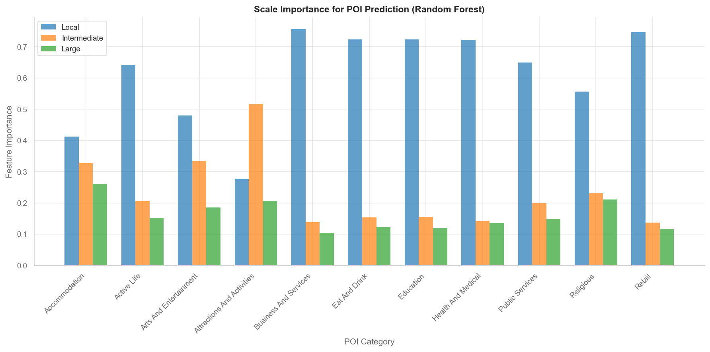

# POI Quality Assessment Report

## Executive Summary

- **Total cities analyzed**: 699
- **Total grid cells**: 43038
- **POI categories**: 11

**Note**: Z-scores represent continuous deviations from predicted POI counts.
The quadrant analysis separates cities based on above or below expected mean
z-score (saturation level) and within-city variability (consistency).

---

## City Quadrant Classification

### Consistently Undersaturated

Low POI coverage with uniformly low saturation across categories.

| City                                       | Country | Mean Z  | Between-Cat Std |
| ------------------------------------------ | ------- | ------- | --------------- |
| Parla                                      | ES      | -1.1188 | 0.3513          |
| Alcorcón                                   | ES      | -0.9122 | 0.4012          |
| Brăila                                     | RO      | -0.8959 | 0.2640          |
| Добрич                                     | BG      | -0.8610 | 0.2712          |
| Ceuta                                      | ES      | -0.8598 | 0.3620          |
| Valdemoro                                  | ES      | -0.8232 | 0.3628          |
| Arganda del Rey                            | ES      | -0.7680 | 0.5209          |
| Vallès Occidental                          | ES      | -0.7516 | 0.2531          |
| Fuenlabrada                                | ES      | -0.7096 | 0.2590          |
| Gasteizko kuadrilla / Cuadrilla de Vitoria | ES      | -0.6938 | 0.1838          |
| Melilla                                    | ES      | -0.6416 | 0.2541          |
| Сливен                                     | BG      | -0.6384 | 0.3556          |
| Bydgoszcz                                  | PL      | -0.6197 | 0.3693          |
| Bilbao                                     | ES      | -0.6193 | 0.1894          |
| Cerignola                                  | IT      | -0.6029 | 0.2475          |
| Magheru                                    | RO      | -0.5912 | 0.2349          |
| Ostrava                                    | CZ      | -0.5827 | 0.2587          |
| Coslada                                    | ES      | -0.5743 | 0.2675          |
| Mantes-la-Jolie                            | FR      | -0.5678 | 0.1941          |
| Хасково                                    | BG      | -0.5676 | 0.2878          |
| None                                       | None    | -0.5639 | 0.1457          |
| Ortsbeirat 6 : Evershagen                  | DE      | -0.5536 | 0.2020          |
| Galați                                     | RO      | -0.5525 | 0.1794          |
| Andria                                     | IT      | -0.5477 | 0.3225          |
| Плевен                                     | BG      | -0.5404 | 0.2407          |
| Ploiești                                   | RO      | -0.5396 | 0.2313          |
| Vallès Occidental                          | ES      | -0.5364 | 0.2076          |
| Acerra                                     | IT      | -0.5251 | 0.2590          |
| Jastrzębie-Zdrój                           | PL      | -0.5205 | 0.2872          |
| Torrejón de Ardoz                          | ES      | -0.5197 | 0.3160          |

### Consistently Saturated

High & Uniform

| City                     | Country | Mean Z | Between-Cat Std |
| ------------------------ | ------- | ------ | --------------- |
| Monheim am Rhein         | DE      | 0.0007 | 0.1869          |
| Västerås                 | SE      | 0.0007 | 0.1563          |
| Sjöberg                  | SE      | 0.0009 | 0.2177          |
| Szczecin                 | PL      | 0.0017 | 0.2028          |
| Roosendaal               | NL      | 0.0019 | 0.3400          |
| Brackel                  | DE      | 0.0038 | 0.2800          |
| Jürgensby                | DE      | 0.0043 | 0.1634          |
| Düren                    | DE      | 0.0044 | 0.2146          |
| Bellizzi                 | IT      | 0.0086 | 0.2863          |
| České Budějovice         | CZ      | 0.0087 | 0.2166          |
| Jena-Zentrum             | DE      | 0.0101 | 0.2911          |
| Veenendaal               | NL      | 0.0102 | 0.2616          |
| Hilden                   | DE      | 0.0104 | 0.2136          |
| Perpignan                | FR      | 0.0105 | 0.1214          |
| Tilburg                  | NL      | 0.0108 | 0.2123          |
| Tours                    | FR      | 0.0109 | 0.1559          |
| Neusäß                   | DE      | 0.0112 | 0.1805          |
| Wolfsburg                | DE      | 0.0112 | 0.1049          |
| Milano                   | IT      | 0.0114 | 0.1549          |
| Gallarate                | IT      | 0.0122 | 0.2138          |
| Košice                   | SK      | 0.0125 | 0.2069          |
| Debrecen                 | HU      | 0.0128 | 0.2056          |
| Saint-Julien-en-Genevois | CH      | 0.0132 | 0.1345          |
| Montpellier              | FR      | 0.0140 | 0.2057          |
| Strasbourg               | FR      | 0.0154 | 0.1741          |
| Gironès                  | ES      | 0.0158 | 0.1854          |
| Nord                     | DE      | 0.0160 | 0.1911          |
| Zagreb                   | HR      | 0.0175 | 0.1424          |
| Częstochowa              | PL      | 0.0175 | 0.3156          |
| Grenoble                 | FR      | 0.0178 | 0.1830          |

---

## Model Performance by Category

| Category                   | R² Score | Local Importance | Intermediate Importance | Large Importance |
| -------------------------- | -------- | ---------------- | ----------------------- | ---------------- |
| Accommodation              | 0.5556   | 0.4119           | 0.3275                  | 0.2606           |
| Active Life                | 0.6545   | 0.6414           | 0.2061                  | 0.1525           |
| Arts And Entertainment     | 0.6342   | 0.4801           | 0.3341                  | 0.1858           |
| Attractions And Activities | 0.6039   | 0.2760           | 0.5168                  | 0.2072           |
| Business And Services      | 0.7284   | 0.7566           | 0.1388                  | 0.1046           |
| Eat And Drink              | 0.7162   | 0.7231           | 0.1543                  | 0.1226           |
| Education                  | 0.7256   | 0.7241           | 0.1551                  | 0.1208           |
| Health And Medical         | 0.6934   | 0.7228           | 0.1419                  | 0.1354           |
| Public Services            | 0.6851   | 0.6497           | 0.2012                  | 0.1491           |
| Religious                  | 0.5850   | 0.5563           | 0.2322                  | 0.2115           |
| Retail                     | 0.7028   | 0.7465           | 0.1370                  | 0.1164           |

---

## Visualizations

The following visualizations have been generated to support this analysis:

### Exploratory Data Analysis

Key insights:

- **Z-Score Distribution**: Distribution of z-scores across grid cells per category
- **Population Distribution**: Distribution of local population across census grid cells
- **Model Fit (R²)**: Model fit quality for each POI category
- **City Z-Score Distribution**: Distribution of mean z-scores across cities

### Feature Importance Analysis

Shows which population scale (local, intermediate, large) is most predictive for each POI category.
Higher values indicate the scale is more important for predicting POI distribution.

### Regression Diagnostics

Predicted vs observed POI counts for each category. Shows model fit quality and outliers.
Points closer to the diagonal line indicate better predictions.

### City Quadrant Analysis

12-panel visualization (4×3 grid) showing city quadrant classification by POI category:

- **First 11 panels**: Per-category analysis (mean z-score vs spatial std within category)
- **12th panel**: Between-category summary (mean across categories vs std between categories)

Each panel uses consistent color coding for quadrants:

- **Red** (bottom-left): Consistently Undersaturated
- **Green** (bottom-right): Consistently Saturated
- **Orange** (top-left): Variable Undersaturated
- **Blue** (top-right): Variable Saturated

---

## Output Files

### Data Files

- **outputs/grid_counts_regress.gpkg**: Vector grid dataset with z-scores and predictions
- **outputs/city_analysis_results.gpkg**: City-level z-score statistics and per-category + between-category quadrant classifications

### Visualization Files

- **outputs/eda_analysis.png**: Exploratory data analysis
- **outputs/feature_importance.png**: Random Forest feature importance comparison
- **outputs/regression_diagnostics.png**: Predicted vs observed plots for all categories
- **outputs/city_quadrant_analysis.png**: 12-panel per-category and between-category quadrant analysis
