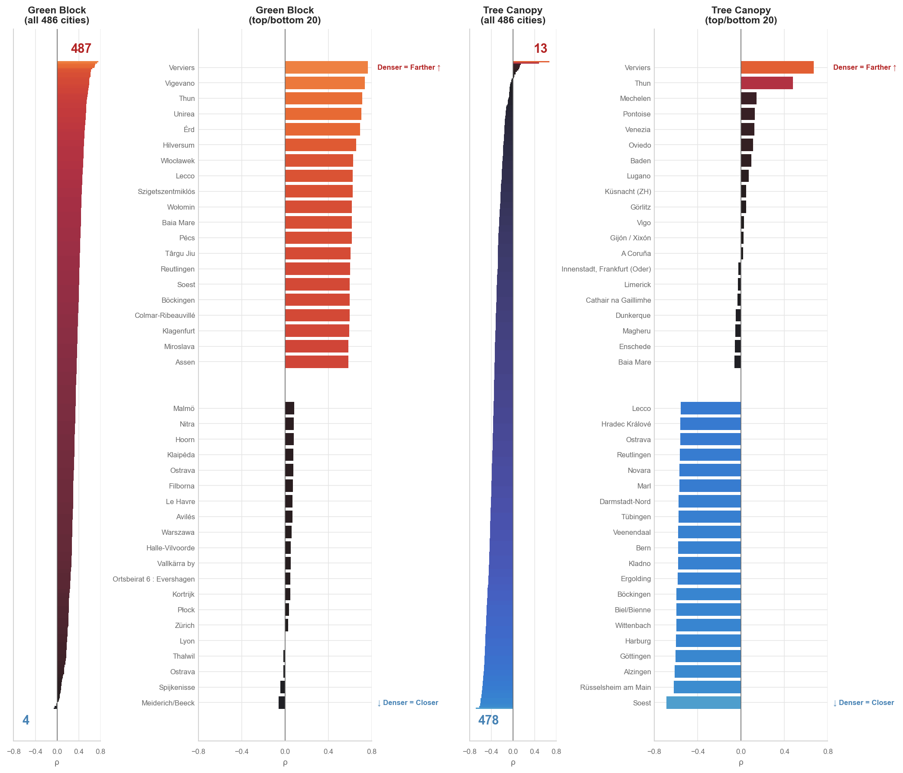

# Green Block Accessibility Analysis Report

**Analysis Date:** 2025-12-18

## Summary Statistics

- **Total Street Network Nodes Analyzed:** 18,700,254
- **Cities Analyzed:** 491
- **Cities with Correlation Data:** 491 (min 100 nodes)

### Green Blocks (Parks & Green Spaces)
- **Mean Distance:** 140.3m
- **Median Distance:** 70.7m
- **% Within 400m (5-min walk):** 91.1%

### Tree Canopy
- **Mean Distance:** 186.0m
- **Median Distance:** 76.6m
- **% Within 400m (5-min walk):** 85.9%

## Per-City Density-Green Access Correlations

This analysis examines whether denser urban areas have better or worse access to green block.
- **Negative correlation**: Denser areas are *closer* to green block (better access)
- **Positive correlation**: Denser areas are *farther* from green block (worse access)

### Green Block: 4 cities negative, 487 cities positive

**Strongest negative (denser = closer):**

- Meiderich/Beeck (DE): r = -0.057
- Spijkenisse (NL): r = -0.042
- Ostrava (CZ): r = -0.016
- Thalwil (CH): r = -0.015
- Lyon (FR): r = 0.001

**Strongest positive (denser = farther):**

- Verviers (BE): r = 0.762
- Vigevano (IT): r = 0.736
- Thun (CH): r = 0.710
- Unirea (RO): r = 0.702
- Érd (HU): r = 0.690

### Tree Canopy: 478 cities negative, 13 cities positive

**Strongest negative (denser = closer):**

- Soest (NL): r = -0.689
- Rüsselsheim am Main (DE): r = -0.620
- Alzingen (LU): r = -0.610
- Göttingen (DE): r = -0.605
- Harburg (DE): r = -0.598

**Strongest positive (denser = farther):**

- Verviers (BE): r = 0.670
- Thun (CH): r = 0.477
- Mechelen (BE): r = 0.145
- Pontoise (FR): r = 0.129
- Venezia (IT): r = 0.124

## Key Finding

The relationship between population density and green block access varies substantially
by city, reflecting different urban planning approaches and historical development patterns.
This heterogeneity demonstrates why city-specific analysis is essential for understanding
environmental equity rather than relying on aggregate statistics.

## Visualization

