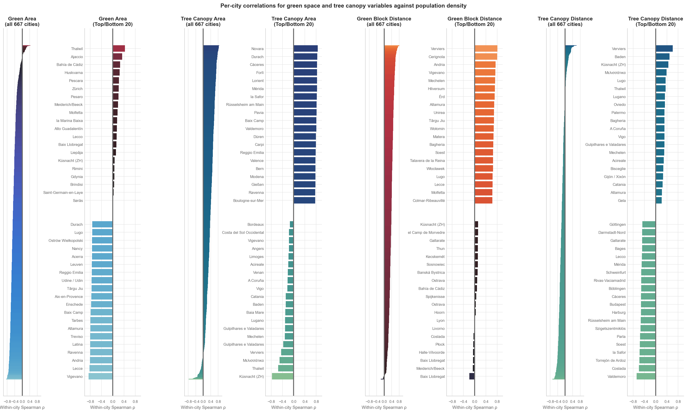

# Green Block Accessibility Analysis Report

**Analysis Date:** 2025-12-31

## Summary Statistics

- **Total Street Network Nodes Analyzed:** 16,571,683
- **Cities Analyzed:** 672
- **Cities with Correlation Data:** 672 (min 100 nodes)

### Green Blocks (Parks & Green Spaces)
- **Mean Distance:** 149.7m
- **Median Distance:** 93.5m
- **% Within 400m (5-min walk):** 91.0%

### Tree Canopy
- **Mean Distance:** 143.8m
- **Median Distance:** 72.2m
- **% Within 400m (5-min walk):** 91.2%

## Per-City Density-Green Access Correlations

This analysis examines whether denser urban areas have better or worse access to green block.
- **Negative correlation**: Denser areas are *closer* to green block (better access)
- **Positive correlation**: Denser areas are *farther* from green block (worse access)

### Green Block: 6 cities negative, 666 cities positive

**Strongest negative (denser = closer):**

- Baix Llobregat (ES): r = -0.186
- Meiderich/Beeck (DE): r = -0.069
- Baix Llobregat (ES): r = -0.059
- Halle-Vilvoorde (BE): r = -0.054
- Płock (PL): r = -0.050

**Strongest positive (denser = farther):**

- Verviers (BE): r = 0.806
- Cerignola (IT): r = 0.797
- Andria (IT): r = 0.741
- Vigevano (IT): r = 0.739
- Mechelen (BE): r = 0.727

### Tree Canopy: 569 cities negative, 103 cities positive

**Strongest negative (denser = closer):**

- Valdemoro (ES): r = -0.673
- Coslada (ES): r = -0.595
- Torrejón de Ardoz (ES): r = -0.573
- la Safor (ES): r = -0.568
- Soest (NL): r = -0.564

**Strongest positive (denser = farther):**

- Verviers (BE): r = 0.612
- Baden (CH): r = 0.492
- Küsnacht (ZH) (CH): r = 0.449
- Μελισσάτικα (GR): r = 0.390
- Lugo (ES): r = 0.357

### Green Area (800m buffer): 650 cities negative, 22 cities positive

**Strongest negative (denser = more green area):**

- Vigevano (IT): r = -0.858
- Lecce (IT): r = -0.827
- Andria (IT): r = -0.811
- Ravenna (IT): r = -0.805
- Latina (IT): r = -0.802

**Strongest positive (denser = less green area):**

- Thalwil (CH): r = 0.435
- Ajaccio (FR): r = 0.334
- Bahía de Cádiz (ES): r = 0.262
- Huskvarna (SE): r = 0.242
- Pescara (IT): r = 0.220

### Tree Canopy Area (800m buffer): 49 cities negative, 623 cities positive

**Strongest negative (denser = more tree canopy):**

- Küsnacht (ZH) (CH): r = -0.775
- Thalwil (CH): r = -0.554
- Μελισσάτικα (GR): r = -0.504
- Verviers (BE): r = -0.443
- Gulpilhares e Valadares (PT): r = -0.368

**Strongest positive (denser = less tree canopy):**

- Novara (IT): r = 0.853
- Durach (DE): r = 0.837
- Cáceres (ES): r = 0.832
- Forlì (IT): r = 0.831
- Lorient (FR): r = 0.828

## Key Finding

The relationship between population density and green block access varies substantially
by city, reflecting different urban planning approaches and historical development patterns.
This heterogeneity demonstrates why city-specific analysis is essential for understanding
environmental equity rather than relying on aggregate statistics.

## Visualization

