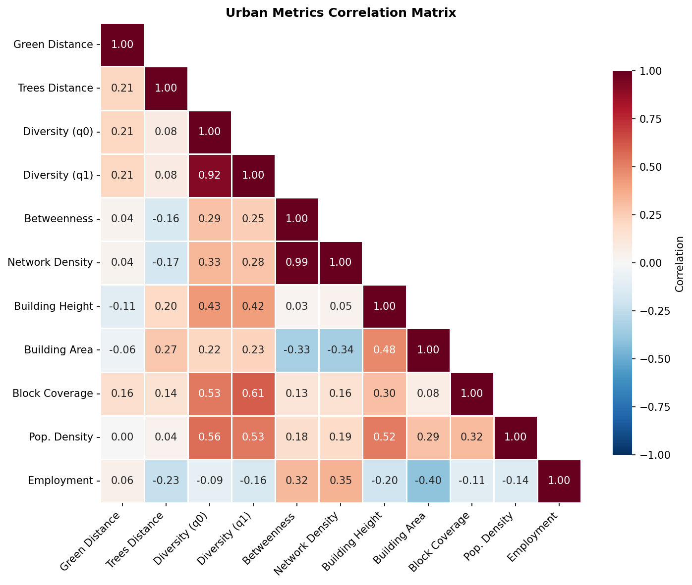
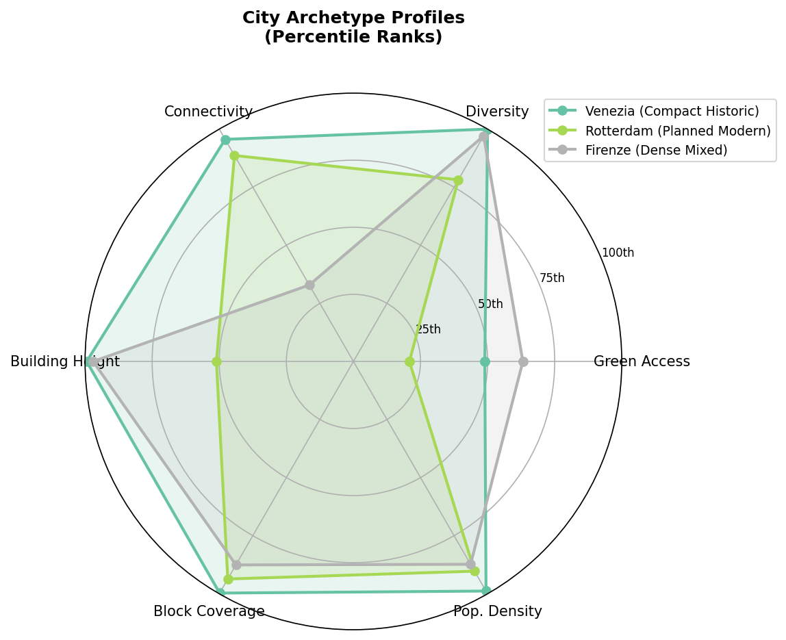
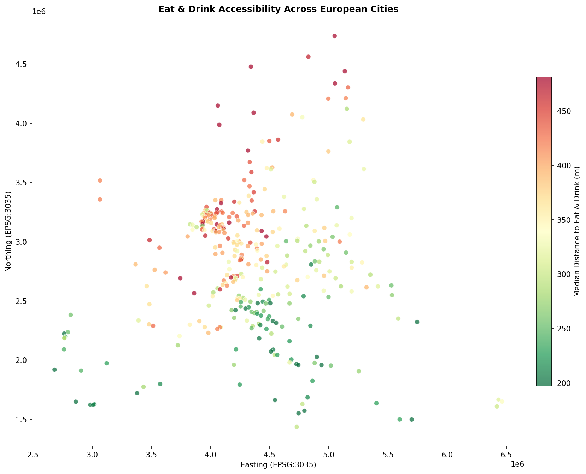

# European Urban Metrics Benchmarking Reference

**Analysis Date:** 2026-01-03

## Vignette Purpose

Provides standardised reference statistics (min, 5th, 25th, 50th, 75th, 95th percentiles, max) across
all street network nodes in European cities, enabling comparative assessment against peer data.

## Summary Statistics

- **Cities analyzed:** 339
- **Countries represented:** 29
- **Total network nodes:** 9,374,220
- **Total data points:** 432,002,714
- **Distance threshold:** 400m

## Metrics Categories

| Category                   | Metrics                                          | Distance     |
| -------------------------- | ------------------------------------------------ | ------------ |
| **Land-use accessibility** | Distance to nearest POI per category             | nearest      |
| **Land-use diversity**     | Hill q0 (richness), q1 (Shannon), q2 (Simpson)   | 400m         |
| **Network centrality**     | Betweenness, density, cycles, harmonic closeness | 400m         |
| **Green space**            | Distance to green/trees, area coverage           | 400m         |
| **Building morphology**    | Height, area, compactness, volume, FAR, coverage | 200m         |
| **Census demographics**    | Population density, employment, age structure    | interpolated |

## Benchmark Statistics

| Metric                                | Min    | P5    | P25   | P50   | P75   | P95    | Max        |
| ------------------------------------- | ------ | ----- | ----- | ----- | ----- | ------ | ---------- |
| Accommodation Nearest M               | 0.0    | 99.4  | 324.1 | 597.2 | 951.6 | 1,414  | 1,600      |
| Active Life Nearest M                 | 0.0    | 75.0  | 213.7 | 383.7 | 649.2 | 1,200  | 1,600      |
| Arts And Entertainment Nearest M      | 0.1    | 102.4 | 307.4 | 553.3 | 888.1 | 1,379  | 1,600      |
| Attractions And Activities Nearest M  | 0.1    | 85.1  | 263.4 | 481.2 | 792.6 | 1,315  | 1,600      |
| Business And Services Nearest M       | 0.0    | 16.9  | 71.3  | 147.9 | 300.1 | 828.5  | 1,600      |
| Eat And Drink Nearest M               | 0.0    | 44.6  | 167.9 | 339.6 | 612.7 | 1,176  | 1,600      |
| Education Nearest M                   | 0.0    | 68.4  | 198.0 | 372.2 | 669.7 | 1,260  | 1,600      |
| Health And Medical Nearest M          | 0.0    | 57.8  | 181.0 | 354.4 | 655.4 | 1,251  | 1,600      |
| Public Services Nearest M             | 0.0    | 64.7  | 194.5 | 371.3 | 660.5 | 1,233  | 1,600      |
| Religious Nearest M                   | 0.1    | 137.2 | 378.5 | 650.0 | 1,001 | 1,441  | 1,600      |
| Retail Nearest M                      | 0.0    | 28.4  | 119.0 | 245.5 | 470.3 | 1,052  | 1,600      |
| Accommodation Count 400M              | 0.0    | 0.0   | 0.0   | 0.0   | 1.0   | 5.0    | 282.0      |
| Active Life Count 400M                | 0.0    | 0.0   | 0.0   | 1.0   | 2.0   | 7.0    | 68.0       |
| Arts And Entertainment Count 400M     | 0.0    | 0.0   | 0.0   | 0.0   | 1.0   | 4.0    | 120.0      |
| Attractions And Activities Count 400M | 0.0    | 0.0   | 0.0   | 0.0   | 1.0   | 5.0    | 169.0      |
| Business And Services Count 400M      | 0.0    | 0.0   | 1.0   | 7.0   | 20.0  | 75.0   | 891.0      |
| Eat And Drink Count 400M              | 0.0    | 0.0   | 0.0   | 1.0   | 4.0   | 26.0   | 572.0      |
| Education Count 400M                  | 0.0    | 0.0   | 0.0   | 1.0   | 2.0   | 10.0   | 135.0      |
| Health And Medical Count 400M         | 0.0    | 0.0   | 0.0   | 1.0   | 3.0   | 16.0   | 250.0      |
| Public Services Count 400M            | 0.0    | 0.0   | 0.0   | 1.0   | 2.0   | 10.0   | 241.0      |
| Religious Count 400M                  | 0.0    | 0.0   | 0.0   | 0.0   | 0.0   | 3.0    | 69.0       |
| Retail Count 400M                     | 0.0    | 0.0   | 0.0   | 2.0   | 8.0   | 42.0   | 735.0      |
| Street Furn Nearest M                 | 0.0    | 36.3  | 136.2 | 274.9 | 521.7 | 1,127  | 1,600      |
| Parking Nearest M                     | 0.0    | 136.1 | 406.9 | 714.8 | 1,081 | 1,474  | 1,600      |
| Transport Nearest M                   | 0.0    | 53.9  | 158.6 | 283.2 | 490.9 | 1,071  | 1,600      |
| Hill Q0 Richness                      | 0.0    | 0.0   | 2.0   | 5.0   | 8.0   | 11.0   | 11.0       |
| Hill Q1 Shannon                       | 0.0    | 0.0   | 2.0   | 3.8   | 5.2   | 6.8    | 10.6       |
| Hill Q2 Simpson                       | 0.0    | 0.0   | 1.8   | 3.0   | 4.1   | 5.5    | 10.2       |
| Betweenness                           | 0.0    | 0.0   | 46.0  | 151.0 | 379.0 | 1,117  | 53,084     |
| Network Density                       | 5.0    | 19.0  | 55.0  | 96.0  | 147.0 | 258.0  | 904.0      |
| Cycles                                | 0.0    | 5.0   | 31.0  | 71.0  | 135.0 | 301.0  | 1,566      |
| Harmonic Closeness                    | 0.0    | 0.1   | 0.3   | 0.5   | 0.8   | 1.4    | 5.8        |
| Green Nearest M                       | 0.0    | 0.0   | 4.6   | 87.6  | 218.8 | 480.6  | 1,600      |
| Trees Nearest M                       | 0.0    | 0.0   | 18.4  | 68.7  | 170.9 | 536.7  | 1,600      |
| Green Area 400M                       | 0.0    | 0.0   | 0.0   | 0.2   | 0.6   | 4.9    | 504.0      |
| Trees Area 400M                       | 0.0    | 0.0   | 0.0   | 0.0   | 0.1   | 0.4    | 11.3       |
| Building Height M                     | 1.0    | 3.5   | 4.7   | 6.0   | 8.5   | 15.7   | 173.5      |
| Building Area M2                      | 0.0    | 24.3  | 64.4  | 114.8 | 216.8 | 665.0  | 139,263    |
| Building Compactness                  | 0.0    | 0.4   | 0.5   | 0.5   | 0.6   | 0.6    | 1.0        |
| Building Volume M3                    | 0.6    | 139.5 | 384.0 | 755.5 | 2,065 | 9,193  | 2,430,304  |
| Floor Area Ratio                      | 0.0    | 37.0  | 94.6  | 190.4 | 556.8 | 2,656  | 727,371    |
| Block Coverage Ratio                  | 0.0    | 0.0   | 0.1   | 0.2   | 0.3   | 0.5    | 23.1       |
| Pop Density Per Km2                   | 0.0    | 226.0 | 1,445 | 3,001 | 5,227 | 10,271 | 22,852,768 |
| Employment Rate                       | -9,902 | 0.4   | 0.4   | 0.5   | 0.5   | 0.6    | 3.3        |
| Age Under15 Pct                       | -9,902 | 0.1   | 0.1   | 0.1   | 0.2   | 0.2    | 2.3        |
| Age 15To64 Pct                        | -9,902 | 0.6   | 0.6   | 0.7   | 0.7   | 0.8    | 3.0        |
| Age Over65 Pct                        | -9,902 | 0.1   | 0.2   | 0.2   | 0.2   | 0.3    | 2.2        |
| Male Pct                              | -9,902 | 0.5   | 0.5   | 0.5   | 0.5   | 0.5    | 3.3        |
| Female Pct                            | -9,902 | 0.5   | 0.5   | 0.5   | 0.5   | 0.5    | 1.8        |

## Output Files

| File                      | Description                                               |
| ------------------------- | --------------------------------------------------------- |
| `benchmark_reference.csv` | Full per-city statistics for all metrics                  |
| `benchmark_summary.csv`   | Cross-city aggregated statistics (P5, P25, P50, P75, P95) |
| `country_rankings.csv`    | Country-level metric aggregations                         |

## Visualizations

### Correlation Matrix

### City Archetype Profiles

### Geographic Distribution of Eat & Drink Access

## LaTeX Tables

- `table_benchmark_summary.tex` - Full metrics summary (all percentiles)
- `table_landuse_benchmarks.tex` - Land-use accessibility by category

## Usage

The benchmark reference enables:

1. **City comparison** - Compare individual city metrics against European percentiles
2. **Policy targets** - Set evidence-based targets using percentile thresholds
3. **Gap analysis** - Identify metrics where a city falls below P25 or above P75
4. **Country patterns** - Understand national-level urban form characteristics
