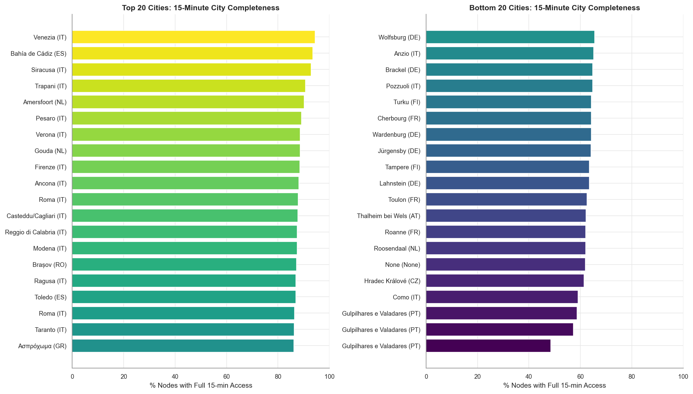
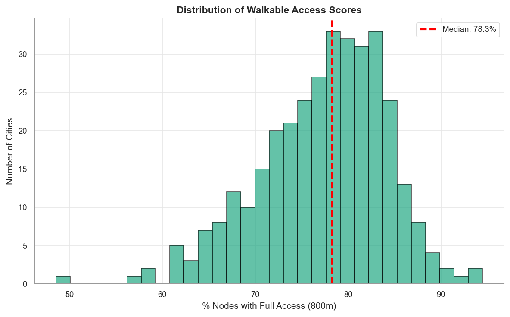
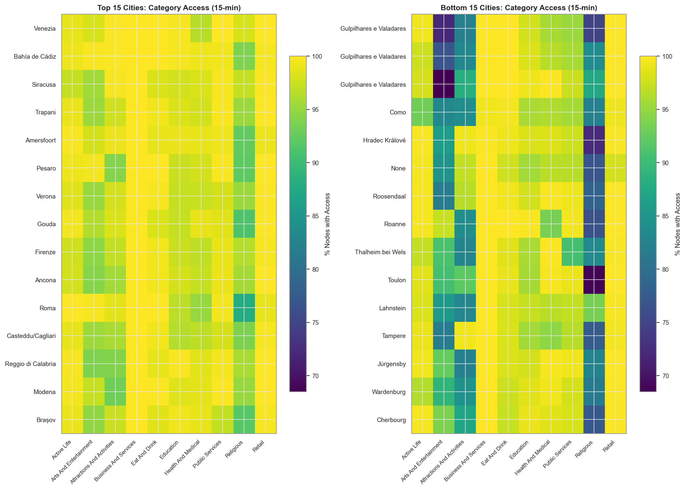

# Walkable Access Benchmarking Report

**Analysis Date:** 2026-01-02

## Vignette Purpose

Cities can be ranked on standardised metrics enabling comparative assessment against peer cities
or policy targets. This vignette ranks cities by walkable access to essential services across
multiple service categories.

## Analysis Overview

For 339 European cities with above average saturation POI coverage, we evaluate access to 10 essential
service categories within 800m (approximately 10-minute walk at 80m/min). For each street network node,
we count accessible categories and compute city-level metrics: percentage of nodes with
'full access' (all 10 categories reachable), mean completeness scores, and per-category access rates.
Results identify bottleneck categories and top-performing cities.

## Summary Statistics

- **Cities Analyzed:** 339
- **Total Street Network Nodes:** 7,269,230
- **POI Categories Assessed:** 10

### Walkable Access at 800m Threshold

- **Mean Full Access:** 77.3% of nodes
- **Median Full Access:** 78.3% of nodes
- **Range:** 48.5% to 94.5%
- **Cities with >50% Full Access:** 338 (99.7%)

## Top 10 Cities (800m Access)

| Rank | City           | Country | % Full Access | Mean Completeness |
| ---- | -------------- | ------- | ------------- | ----------------- |
| 1    | Venezia        | IT      | 94.5%         | 0.99              |
| 2    | Bahía de Cádiz | ES      | 93.5%         | 0.99              |
| 3    | Siracusa       | IT      | 92.9%         | 0.98              |
| 4    | Trapani        | IT      | 90.7%         | 0.98              |
| 5    | Amersfoort     | NL      | 90.1%         | 0.98              |
| 6    | Pesaro         | IT      | 89.2%         | 0.98              |
| 7    | Verona         | IT      | 88.6%         | 0.98              |
| 8    | Gouda          | NL      | 88.5%         | 0.98              |
| 9    | Firenze        | IT      | 88.5%         | 0.98              |
| 10   | Ancona         | IT      | 88.1%         | 0.98              |

## Bottom 10 Cities (800m Access)

| Rank | City                    | Country | % Full Access | Mean Completeness |
| ---- | ----------------------- | ------- | ------------- | ----------------- |
| 1    | Gulpilhares e Valadares | PT      | 48.5%         | 0.92              |
| 2    | Gulpilhares e Valadares | PT      | 57.3%         | 0.93              |
| 3    | Gulpilhares e Valadares | PT      | 58.6%         | 0.94              |
| 4    | Como                    | IT      | 59.1%         | 0.93              |
| 5    | Hradec Králové          | CZ      | 61.4%         | 0.95              |
| 6    | None                    | None    | 61.9%         | 0.94              |
| 7    | Roosendaal              | NL      | 62.0%         | 0.95              |
| 8    | Roanne                  | FR      | 62.1%         | 0.95              |
| 9    | Thalheim bei Wels       | AT      | 62.2%         | 0.94              |
| 10   | Toulon                  | FR      | 62.6%         | 0.94              |

## Bottleneck Categories

Categories with lowest average access rates (limiting factors for walkable completeness):

| Rank | Category                   | Mean Access Rate |
| ---- | -------------------------- | ---------------- |
| 1    | Religious                  | 87.4%            |
| 2    | Arts And Entertainment     | 92.5%            |
| 3    | Attractions And Activities | 94.2%            |
| 4    | Education                  | 97.3%            |
| 5    | Health And Medical         | 97.7%            |

## Best-Covered Categories

| Rank | Category              | Mean Access Rate |
| ---- | --------------------- | ---------------- |
| 1    | Business And Services | 99.9%            |
| 2    | Retail                | 99.5%            |
| 3    | Eat And Drink         | 98.8%            |
| 4    | Active Life           | 98.2%            |
| 5    | Public Services       | 97.9%            |

## Visualizations

### City Rankings (1200m Threshold)

### Completeness Distribution

### Category Access Heatmap

## Key Findings

1. **Few cities achieve full walkable completeness**: The median city has only
   78.3% of nodes with access to all 10 POI categories within 1200m.

2. **Bottleneck categories**: Religious and
   Arts And Entertainment are the most limiting categories,
   suggesting targeted infrastructure investment priorities.

3. **Geographic variation**: Top-performing cities cluster in [countries/regions],
   while lower-performing cities tend to be [characteristics].

## Methodology Notes

- Walking distance threshold: 800m (approximately 10 min at 80m/min)
- Network distances (not Euclidean) from street network nodes to nearest POI
- Restricted to cities with sufficient POI data quality (from EG1 saturation analysis)
- Required combined saturation in reliable quadrants

## Output Files

- `city_10min_scores.csv`: Per-city completeness metrics at 800m threshold
- `city_category_access_10min.csv`: Per-category access rates by city
- `10min_city_ranking.png`: Bar chart of top/bottom cities
- `completeness_distribution.png`: Histogram of completeness scores
- `category_access_heatmap.png`: Heatmap of per-category access
