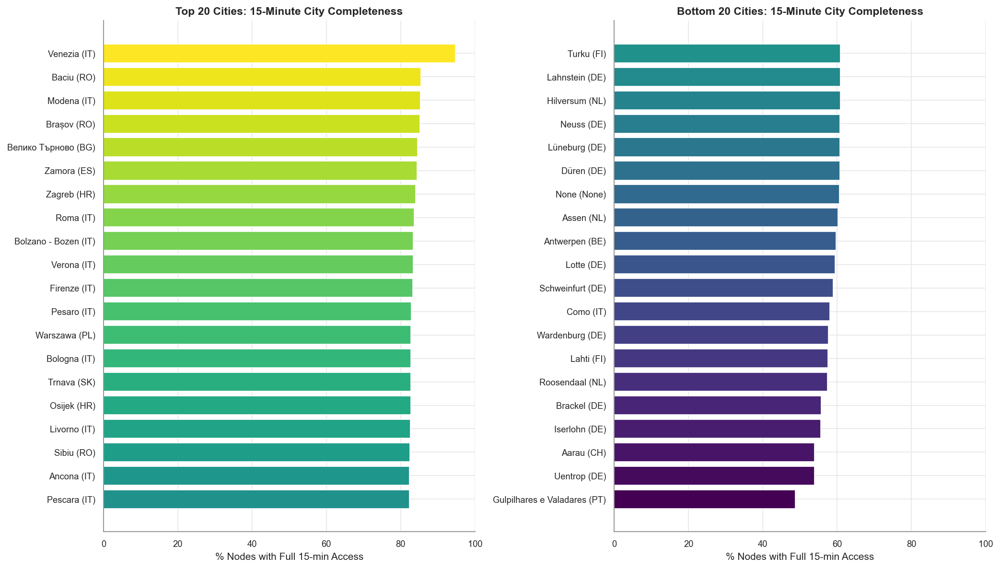
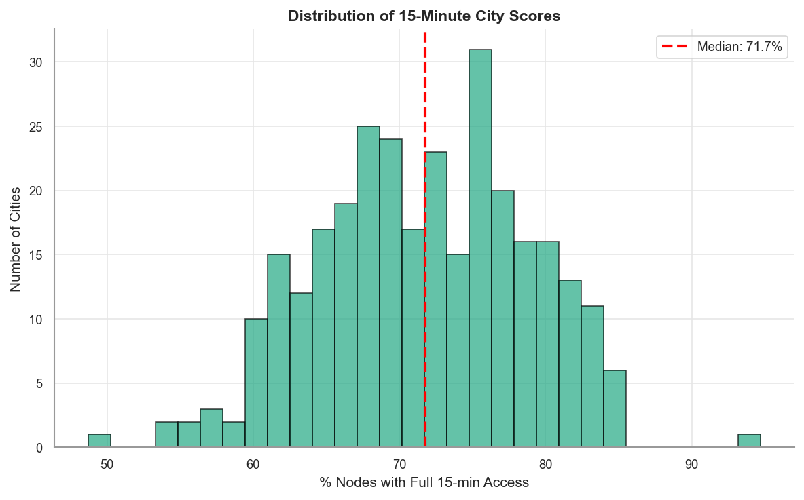
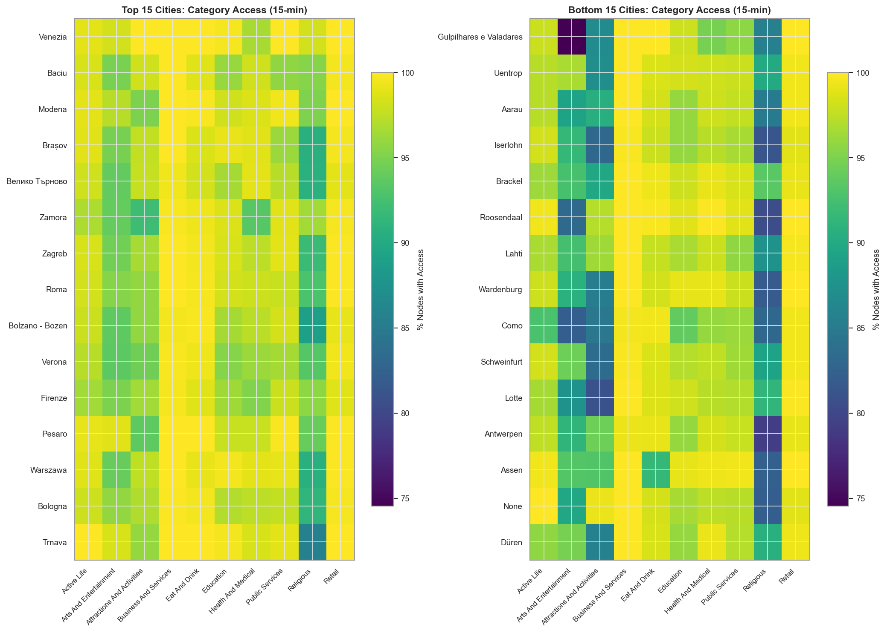

# 15-Minute City Benchmarking Report

**Analysis Date:** 2025-12-19

## Overview

This analysis evaluates how well European cities approximate the "15-minute city" ideal,
where residents can access all essential services within a 15-minute walk (1200m).

## Summary Statistics

- **Cities Analyzed:** 301
- **Total Street Network Nodes:** 8,069,356
- **POI Categories Assessed:** 10

### 15-Minute City (1200m threshold)

- **Mean Full Access:** 71.6% of nodes
- **Median Full Access:** 71.7% of nodes
- **Range:** 48.7% to 94.7%
- **Cities with >50% Full Access:** 300 (99.7%)

## Top 10 Cities (15-Minute Access)

| Rank | City | Country | % Full Access | Mean Completeness |
|------|------|---------|---------------|-------------------|
| 1 | Venezia | IT | 94.7% | 0.99 |
| 2 | Baciu | RO | 85.4% | 0.97 |
| 3 | Modena | IT | 85.3% | 0.98 |
| 4 | Brașov | RO | 85.2% | 0.98 |
| 5 | Велико Търново | BG | 84.6% | 0.97 |
| 6 | Zamora | ES | 84.4% | 0.97 |
| 7 | Zagreb | HR | 84.0% | 0.97 |
| 8 | Roma | IT | 83.6% | 0.97 |
| 9 | Bolzano - Bozen | IT | 83.4% | 0.97 |
| 10 | Verona | IT | 83.4% | 0.97 |

## Bottom 10 Cities (15-Minute Access)

| Rank | City | Country | % Full Access | Mean Completeness |
|------|------|---------|---------------|-------------------|
| 1 | Gulpilhares e Valadares | PT | 48.7% | 0.92 |
| 2 | Uentrop | DE | 53.9% | 0.94 |
| 3 | Aarau | CH | 53.9% | 0.93 |
| 4 | Iserlohn | DE | 55.5% | 0.93 |
| 5 | Brackel | DE | 55.7% | 0.94 |
| 6 | Roosendaal | NL | 57.4% | 0.95 |
| 7 | Lahti | FI | 57.5% | 0.94 |
| 8 | Wardenburg | DE | 57.6% | 0.94 |
| 9 | Como | IT | 58.0% | 0.93 |
| 10 | Schweinfurt | DE | 58.9% | 0.94 |

## Bottleneck Categories

Categories with lowest average access rates (limiting factors for 15-minute completeness):

| Rank | Category | Mean Access Rate |
|------|----------|------------------|
| 1 | Religious | 87.2% |
| 2 | Arts And Entertainment | 92.4% |
| 3 | Attractions And Activities | 94.2% |
| 4 | Education | 97.2% |
| 5 | Health And Medical | 97.7% |

## Best-Covered Categories

| Rank | Category | Mean Access Rate |
|------|----------|------------------|
| 1 | Business And Services | 99.9% |
| 2 | Retail | 99.5% |
| 3 | Eat And Drink | 98.7% |
| 4 | Active Life | 98.1% |
| 5 | Public Services | 97.9% |

## Visualizations

### City Rankings (15-Minute)

### Completeness Distribution

### Category Access Heatmap

## Key Findings

1. **Few cities achieve true 15-minute completeness**: The median city has only
   71.7% of nodes with access to all 10 POI categories within 1200m.

2. **Bottleneck categories**: Religious and
   Arts And Entertainment are the most limiting categories,
   suggesting targeted infrastructure investment priorities.

3. **Geographic variation**: Top-performing cities cluster in [countries/regions],
   while lower-performing cities tend to be [characteristics].

## Methodology Notes

- Walking distance threshold: 1200m (~15 min at 80m/min)
- Network distances (not Euclidean) from street network nodes to nearest POI
- Restricted to cities with sufficient POI data quality (from EG1 saturation analysis)
- Required combined saturation in reliable quadrants

## Output Files

- `city_15min_scores.csv`: Per-city 15-minute completeness metrics
- `city_category_access_15min.csv`: Per-category access rates by city
- `15min_city_ranking.png`: Bar chart of top/bottom cities
- `completeness_distribution.png`: Histogram of completeness scores
- `category_access_heatmap.png`: Heatmap of per-category access
