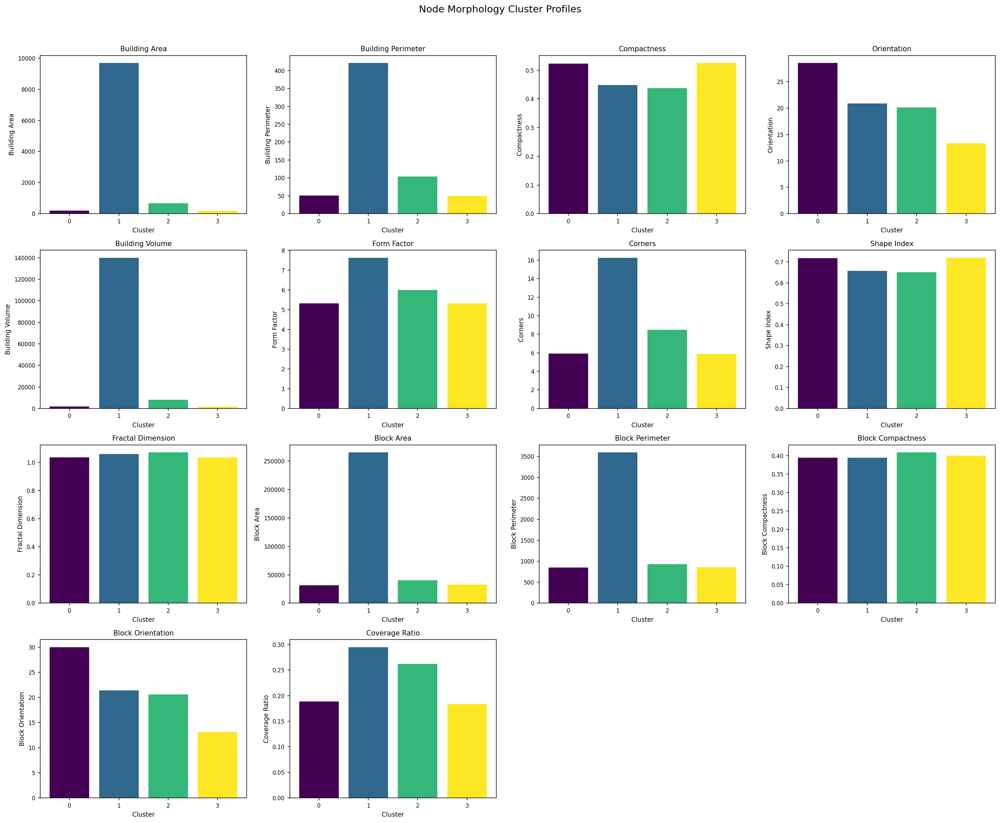
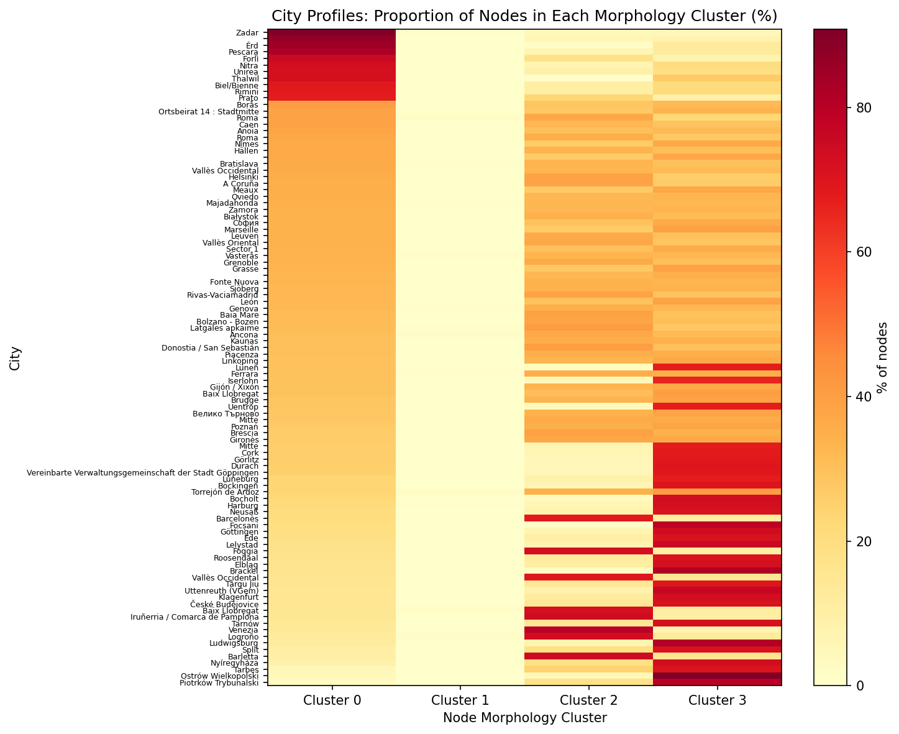
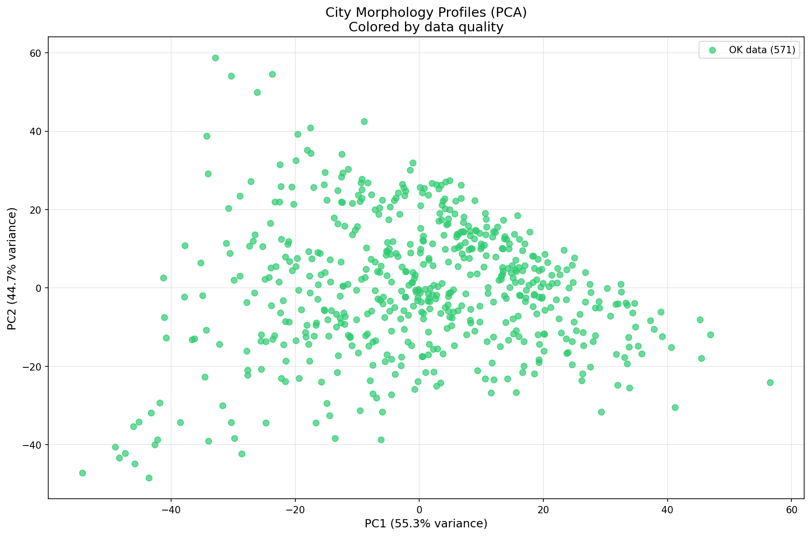

# EG6: Urban Density and Building Morphology Patterns

## Summary

Analysis of population density vs building morphology across 655 European cities.
We cluster **nodes** by morphology profile, then characterize each **city** by the proportion
of its nodes in each cluster type. This preserves within-city heterogeneity.

## Methodology

1. Sample max(20,000, 50%) nodes per city
2. Cluster nodes by 4 morphology features (K-means, k=30):
   - **Building**: area, perimeter, compactness, orientation, volume, form factor, corners, shape index, fractal dimension
   - **Block**: area, perimeter, compactness, orientation, coverage ratio
3. For each city, compute proportion of nodes in each morphology cluster
4. Cities are characterized by their full cluster proportion profile

## Node Morphology Clusters

K-means clustering (k=30) on 14 morphology features identified these node types:

| Cluster | Nodes       | % Total | Mean Area (m²) | Mean Volume (m³) | Mean Coverage | Characterization                            |
| ------- | ----------- | ------- | -------------- | ---------------- | ------------- | ------------------------------------------- |
| 0       | 157,040.0   | 2.2%    | 1171           | 13955            | 0.304         | Large footprint, High volume, High coverage |
| 1       | 296,423.0   | 4.1%    | 327            | 4027             | 0.585         | Small footprint, Low volume, High coverage  |
| 2       | 10,361.0    | 0.1%    | 1823           | 23410            | 0.237         | Large footprint, High volume, High coverage |
| 3       | 146,298.0   | 2.0%    | 179            | 1380             | 0.049         | Small footprint, Low volume, Low coverage   |
| 4       | 396,755.0   | 5.5%    | 82             | 431              | 0.119         | Small footprint, Low volume, Low coverage   |
| 5       | 455,243.0   | 6.3%    | 330            | 3750             | 0.126         | Small footprint, Low volume, Low coverage   |
| 6       | 730,958.0   | 10.2%   | 339            | 3262             | 0.243         | Small footprint, Low volume, High coverage  |
| 7       | 10,250.0    | 0.1%    | 1081           | 7074             | 0.521         | Large footprint, High volume, High coverage |
| 8       | 24.0        | 0.0%    | 48463          | 540663           | 16.207        | Large footprint, High volume, High coverage |
| 9       | 36,665.0    | 0.5%    | 1194           | 15855            | 0.045         | Large footprint, High volume, Low coverage  |
| 10      | 20,486.0    | 0.3%    | 2199           | 27300            | 0.620         | Large footprint, High volume, High coverage |
| 11      | 66,873.0    | 0.9%    | 2258           | 32767            | 0.137         | Large footprint, High volume, Low coverage  |
| 12      | 2,572,184.0 | 35.8%   | 133            | 915              | 0.165         | Small footprint, Low volume, High coverage  |
| 13      | 9,025.0     | 0.1%    | 1795           | 2866             | 0.152         | Large footprint, Low volume, High coverage  |
| 14      | 344,217.0   | 4.8%    | 881            | 12294            | 0.308         | Large footprint, High volume, High coverage |
| 15      | 40,769.0    | 0.6%    | 458            | 1565             | 0.115         | Small footprint, Low volume, Low coverage   |
| 16      | 4,652.0     | 0.1%    | 11190          | 145339           | 0.405         | Large footprint, High volume, High coverage |
| 17      | 20,016.0    | 0.3%    | 373            | 574              | 0.086         | Small footprint, Low volume, Low coverage   |
| 18      | 31,945.0    | 0.4%    | 30             | 114              | 0.033         | Small footprint, Low volume, Low coverage   |
| 19      | 848,818.0   | 11.8%   | 260            | 2714             | 0.313         | Small footprint, Low volume, High coverage  |
| 20      | 153,680.0   | 2.1%    | 501            | 5193             | 0.089         | Small footprint, High volume, Low coverage  |
| 21      | 218,263.0   | 3.0%    | 86             | 499              | 0.101         | Small footprint, Low volume, Low coverage   |
| 22      | 203.0       | 0.0%    | 2868           | 29618            | 1.830         | Large footprint, High volume, High coverage |
| 23      | 2,592.0     | 0.0%    | 11286          | 147612           | 0.124         | Large footprint, High volume, Low coverage  |
| 24      | 11,675.0    | 0.2%    | 1435           | 4132             | 0.148         | Large footprint, High volume, Low coverage  |
| 25      | 282,369.0   | 3.9%    | 84             | 579              | 0.373         | Small footprint, Low volume, High coverage  |
| 26      | 296,701.0   | 4.1%    | 636            | 8116             | 0.132         | Large footprint, High volume, Low coverage  |
| 27      | 12,657.0    | 0.2%    | 63             | 2178             | 0.097         | Small footprint, Low volume, Low coverage   |
| 28      | 12,730.0    | 0.2%    | 170            | 240              | 0.083         | Small footprint, Low volume, Low coverage   |
| 29      | 29.0        | 0.0%    | 6415           | 104576           | 4.283         | Large footprint, High volume, High coverage |



## City Morphology Profiles

Each city is characterized by its distribution across node clusters:





## Cluster Proportion Analysis

Cities are characterized by their distribution across morphology clusters.

### Example City Profiles (Top 5 by Cluster 0)

| City            | Country | % Cluster 0 | % Cluster 1 | % Cluster 2 | % Cluster 3 |
| --------------- | ------- | ----------- | ----------- | ----------- | ----------- | ---- | ----- | ----- | ---- | ---- | ---- | ---- | ---- | ----- | ---- | ---- | ---- | ---- | ---- | ---- | ----- | ----- | ---- | ---- | ---- | ---- | ---- | ----- | ---- | ---- | ---- |
| Pinto           | ES      | 45.2%       | 0.0%        | 0.0%        | 4.5%        | 0.0% | 0.0%  | 13.9% | 0.0% | 0.0% | 0.3% | 0.0% | 1.8% | 1.5%  | 0.0% | 5.4% | 0.9% | 5.7% | 1.5% | 0.0% | 0.0%  | 6.6%  | 0.0% | 0.0% | 0.0% | 3.3% | 0.0% | 7.8%  | 1.5% | 0.0% | 0.0% |
| Narva linn      | EE      | 13.7%       | 0.0%        | 0.2%        | 1.0%        | 2.4% | 5.1%  | 14.7% | 0.0% | 0.0% | 0.3% | 0.0% | 3.2% | 12.2% | 0.2% | 3.3% | 0.7% | 0.0% | 0.2% | 1.6% | 0.2%  | 14.3% | 1.7% | 0.0% | 0.0% | 0.0% | 0.0% | 24.9% | 0.1% | 0.1% | 0.0% |
| Bolzano - Bozen | IT      | 11.8%       | 2.2%        | 0.0%        | 2.2%        | 0.3% | 10.0% | 20.2% | 0.9% | 0.0% | 0.8% | 1.2% | 1.0% | 10.0% | 0.0% | 9.3% | 0.3% | 0.1% | 0.0% | 0.0% | 17.4% | 3.4%  | 1.0% | 0.0% | 0.1% | 0.1% | 0.1% | 7.4%  | 0.1% | 0.0% | 0.0% |
| Vilnius         | LT      | 10.5%       | 0.1%        | 0.6%        | 3.5%        | 1.7% | 6.7%  | 13.6% | 0.0% | 0.0% | 0.8% | 0.2% | 4.8% | 15.7% | 0.1% | 5.9% | 0.5% | 0.1% | 0.3% | 0.0% | 3.6%  | 7.5%  | 1.6% | 0.0% | 0.1% | 0.1% | 0.0% | 21.4% | 0.1% | 0.1% | 0.0% |
| Klaipėda        | LT      | 8.2%        | 0.4%        | 0.3%        | 1.8%        | 3.5% | 6.7%  | 11.5% | 0.1% | 0.0% | 1.1% | 0.2% | 4.7% | 21.3% | 0.1% | 1.7% | 1.1% | 0.0% | 0.6% | 0.5% | 1.8%  | 14.8% | 1.8% | 0.0% | 0.0% | 0.3% | 0.0% | 17.2% | 0.0% | 0.2% | 0.0% |

## Outputs

- `city_morphology_profiles.csv`: Full city profiles with cluster proportions
- `node_cluster_summary.csv`: Node cluster characteristics
- `cluster_representatives.csv`: Representative city for each cluster
- `top_cluster_{{0-3}}_cities.csv`: Top 10 cities by each cluster type
- `node_cluster_profiles.png`: Node cluster characteristic profiles
- `city_profile_heatmap.png`: City proportions across node clusters
- `city_profiles_pca.png`: PCA of city morphology profiles

## Reproducibility

```bash
cd paper_research/code/eg6_density_morph
python eg6_density_morph.py
```

All outputs generated in `outputs/` subfolder.
