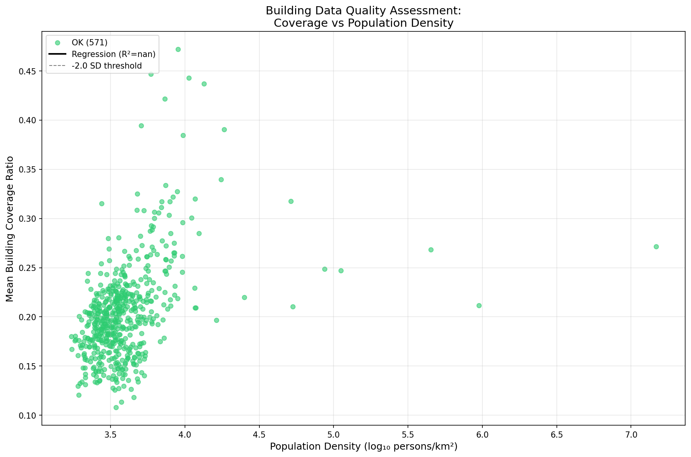

# EG6: Urban Density and Building Morphology Patterns

## Summary

Analysis of population density vs building morphology across 571 European cities.
We cluster **nodes** by morphology profile, then characterize each **city** by the proportion
of its nodes in each cluster type. This preserves within-city heterogeneity.

## Methodology

1. Sample max(20,000, 25%) nodes per city
2. Cluster nodes by 14 morphology features (K-means, k=4):
   - **Building**: area, perimeter, compactness, orientation, volume, form factor, corners, shape index, fractal dimension
   - **Block**: area, perimeter, compactness, orientation, coverage ratio
3. For each city, compute proportion of nodes in each morphology cluster
4. Cities are characterized by their full cluster proportion profile

## Building Data Quality Assessment

We detect potential building data gaps by regressing coverage ratio on population density.
Cities with unusually low coverage given their density are flagged:

- **OK**: 571 cities (within 2 SD of expected coverage)
- **Suspect**: 0 cities (2-3 SD below expected)
- **Poor**: 0 cities (>3 SD below expected)

Regression: R² = nan



## Node Morphology Clusters

K-means clustering (k=4) on 14 morphology features identified these node types:

| Cluster | Nodes       | % Total | Mean Area (m²) | Mean Volume (m³) | Mean Coverage | Characterization                            |
| ------- | ----------- | ------- | -------------- | ---------------- | ------------- | ------------------------------------------- |
| 0       | 2,167,795.0 | 36.1%   | 194            | 1701             | 0.189         | Small footprint, Low volume, Low coverage   |
| 1       | 10,618.0    | 0.2%    | 9692           | 139959           | 0.295         | Large footprint, High volume, High coverage |
| 2       | 1,330,042.0 | 22.1%   | 667            | 8020             | 0.262         | Large footprint, High volume, High coverage |
| 3       | 2,496,303.0 | 41.6%   | 186            | 1626             | 0.183         | Small footprint, Low volume, Low coverage   |


## City Morphology Profiles

Each city is characterized by its distribution across node clusters:


## Cluster Proportion Analysis

Cities are characterized by their distribution across morphology clusters.

### Example City Profiles (Top 5 by Cluster 0)

| City    | Country | % Cluster 0 | % Cluster 1 | % Cluster 2 | % Cluster 3 |
| ------- | ------- | ----------- | ----------- | ----------- | ----------- |
| Zadar   | HR      | 90.4%       | 0.4%        | 4.4%        | 4.7%        |
| None    | None    | 86.3%       | 0.0%        | 5.9%        | 7.8%        |
| Érd     | HU      | 85.1%       | 0.0%        | 2.0%        | 12.9%       |
| Pescara | IT      | 82.0%       | 0.0%        | 6.1%        | 11.8%       |
| Forlì   | IT      | 75.3%       | 0.0%        | 17.3%       | 7.3%        |

## Outputs

- `city_morphology_profiles.csv`: Full city profiles with cluster proportions
- `node_cluster_summary.csv`: Node cluster characteristics
- `top_cluster_{{0-3}}_cities.csv`: Top 10 cities by each cluster type
- `density_coverage_quality.png`: Building data quality assessment (if variance sufficient)
- `node_cluster_profiles.png`: Node cluster characteristic profiles
- `city_profile_heatmap.png`: City proportions across node clusters
- `city_profiles_pca.png`: PCA of city morphology profiles

## Reproducibility

```bash
cd paper_research/code/eg6_density_morph
python eg6_density_morph.py
```

All outputs generated in `outputs/` subfolder.
