# EG6: Urban Density and Building Morphology Patterns

## Vignette Purpose

Clustering algorithms applied to street-level features can identify recurring neighbourhood types
that transcend administrative boundaries. This vignette applies clustering to identify urban
morphological forms and characterises cities by their mix of types.

## Analysis Overview

Across 654 European cities and 30 countries, we sample up to 5,000 nodes per city
(or 25% if larger) and apply BIRCH clustering (k=8) using 8 morphological features at 200m scale:
building count, block count, mean height, height variation, footprint area, fractal dimension,
block coverage, and shared walls ratio. Countries are then characterized by their node distribution
across clusters, revealing regional morphological patterns. External validation uses population density,
network density, and land-use diversity to interpret cluster characteristics.

## Methodology

1. Sample max(5,000, 25%) nodes per city
2. Cluster nodes by 8 morphology features (BIRCH, k=8):
   - Building Count, Block Count, Mean Height, Height Variation, Building Area, Fractal Dimension, Block Coverage, Shared Walls
3. For each country, aggregate proportion of nodes in each morphology cluster
4. Countries are characterized by their full cluster proportion profile
5. Countries are hierarchically clustered by their composition similarity

## Node Morphology Clusters

BIRCH clustering (k=8) on 8 morphology features identified these node types.

**External characterization** uses three independent variables:
- **Population Density**: Average density (people/km²)
- **Network Density**: Street network density (density coefficient)
- **Mixed Uses**: Landuse richness (Hill number q=0)

See cluster rankings visualization for relative ordering.

### Cluster Characteristics

| ID | Nodes | % Total | Pop Density | Network Density | Mixed Use |
|----|-------|---------|-------------|-------------|-----------|
| 1 | 15,652.0 | 7.8% | 13776 | 1372.86 | 7.00 |
| 2 | 21,297.0 | 10.6% | 5764 | 858.46 | 2.48 |
| 3 | 61,610.0 | 30.8% | 5461 | 1025.74 | 3.46 |
| 4 | 2,845.0 | 1.4% | 12988 | 1056.67 | 3.41 |
| 5 | 58,474.0 | 29.2% | 4151 | 799.45 | 2.11 |
| 6 | 17,993.0 | 9.0% | 12118 | 1261.17 | 4.99 |
| 7 | 11,020.0 | 5.5% | 7475 | 1074.55 | 4.06 |
| 8 | 11,109.0 | 5.6% | 13160 | 1058.33 | 4.61 |

### Cluster External Characteristics
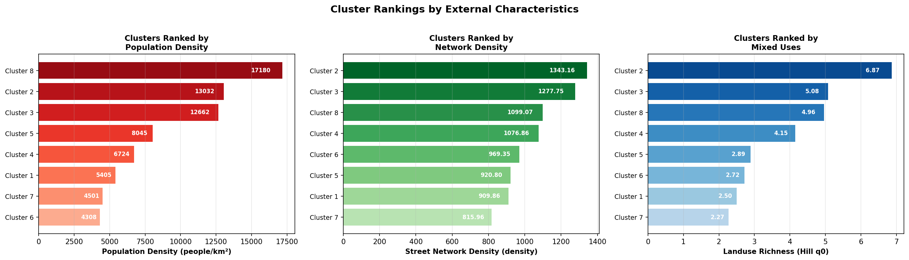

### Cluster Profiles (Radar Plot)
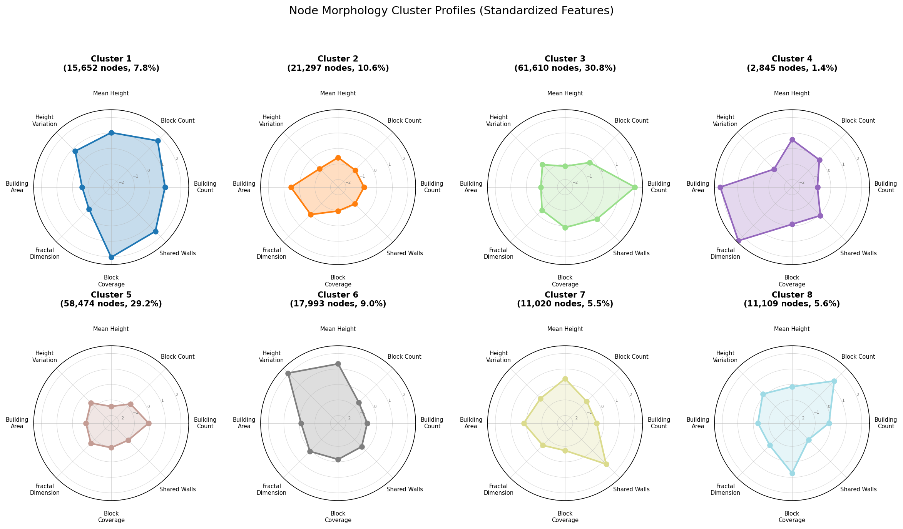

### Feature-Cluster Correlations
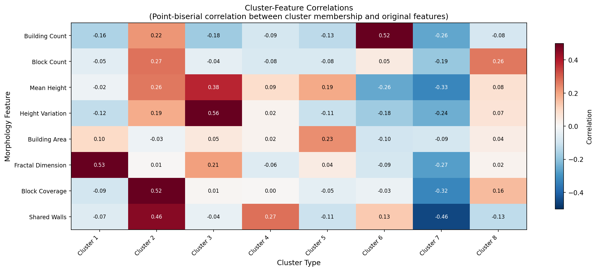

## Country Morphology Profiles

Each country is characterized by its distribution across node clusters.

### Hierarchically Ordered Heatmap
Countries ordered by compositional similarity (Ward linkage):
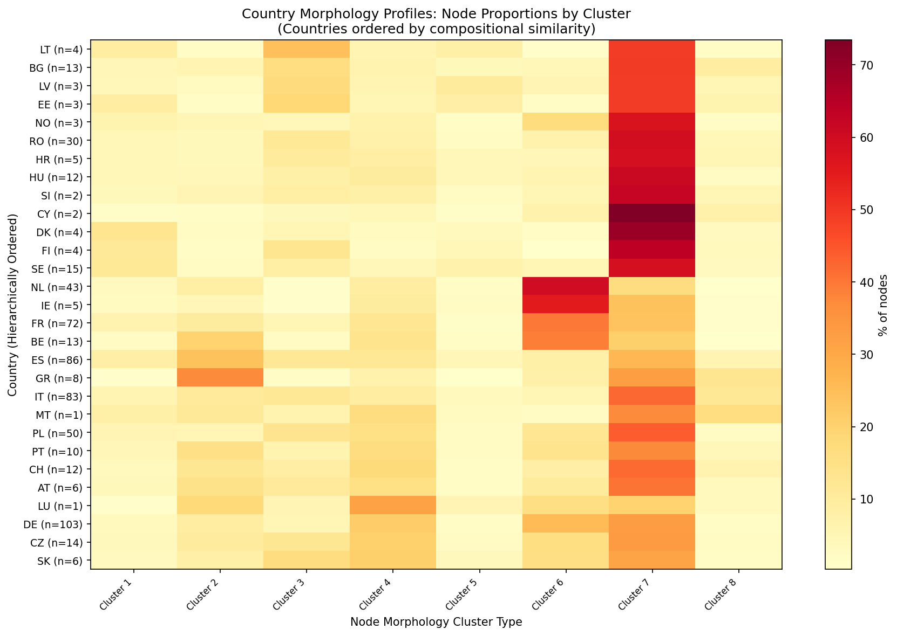

### Stacked Composition Chart
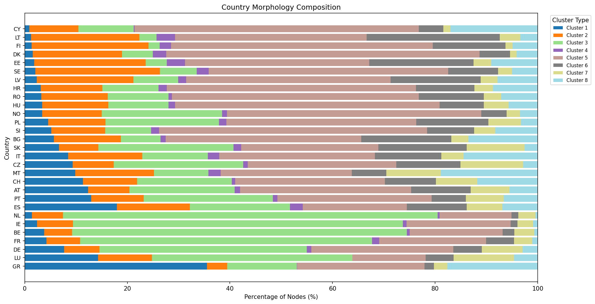

### City Profiles by Cluster Proportions
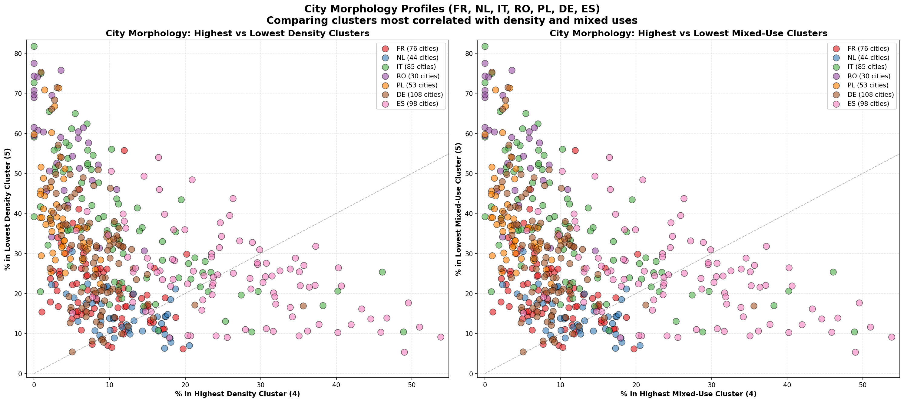

## Morphology Patterns by Country

Countries are characterized by their distribution across morphology clusters.

### Top Countries by Cluster 1

| Country | # Cities | Dominant Cluster | % in Cluster 1 |
|---------|----------|------------------|---------------------|
| GR | 8 | Cluster 1 | 35.5% |
| ES | 86 | Cluster 5 | 17.9% |
| LU | 1 | Cluster 3 | 14.3% |
| PT | 10 | Cluster 5 | 13.0% |
| AT | 6 | Cluster 5 | 12.4% |

### Top Countries by Cluster 2

| Country | # Cities | Dominant Cluster | % in Cluster 2 |
|---------|----------|------------------|---------------------|
| SE | 15 | Cluster 5 | 24.3% |
| FI | 4 | Cluster 5 | 22.8% |
| EE | 3 | Cluster 5 | 21.7% |
| LT | 4 | Cluster 5 | 21.1% |
| LV | 3 | Cluster 5 | 18.8% |

### Top Countries by Cluster 3

| Country | # Cities | Dominant Cluster | % in Cluster 3 |
|---------|----------|------------------|---------------------|
| NL | 43 | Cluster 3 | 73.0% |
| BE | 13 | Cluster 3 | 65.3% |
| IE | 5 | Cluster 3 | 64.3% |
| FR | 72 | Cluster 3 | 56.9% |
| DE | 103 | Cluster 3 | 40.4% |

### Top Countries by Cluster 4

| Country | # Cities | Dominant Cluster | % in Cluster 4 |
|---------|----------|------------------|---------------------|
| LT | 4 | Cluster 5 | 3.6% |
| EE | 3 | Cluster 5 | 3.6% |
| DK | 4 | Cluster 5 | 2.6% |
| ES | 86 | Cluster 5 | 2.5% |
| MT | 1 | Cluster 5 | 2.4% |

### Top Countries by Cluster 5

| Country | # Cities | Dominant Cluster | % in Cluster 5 |
|---------|----------|------------------|---------------------|
| DK | 4 | Cluster 5 | 61.1% |
| CY | 2 | Cluster 5 | 55.4% |
| SI | 2 | Cluster 5 | 52.2% |
| HU | 12 | Cluster 5 | 51.6% |
| FI | 4 | Cluster 5 | 51.0% |

### Top Countries by Cluster 6

| Country | # Cities | Dominant Cluster | % in Cluster 6 |
|---------|----------|------------------|---------------------|
| LT | 4 | Cluster 5 | 26.0% |
| EE | 3 | Cluster 5 | 20.3% |
| LV | 3 | Cluster 5 | 17.6% |
| BG | 13 | Cluster 5 | 17.5% |
| SK | 6 | Cluster 5 | 17.2% |

### Top Countries by Cluster 7

| Country | # Cities | Dominant Cluster | % in Cluster 7 |
|---------|----------|------------------|---------------------|
| CZ | 14 | Cluster 5 | 12.3% |
| LU | 1 | Cluster 3 | 11.8% |
| SK | 6 | Cluster 5 | 11.3% |
| MT | 1 | Cluster 5 | 10.6% |
| CH | 12 | Cluster 5 | 8.1% |

### Top Countries by Cluster 8

| Country | # Cities | Dominant Cluster | % in Cluster 8 |
|---------|----------|------------------|---------------------|
| MT | 1 | Cluster 5 | 18.9% |
| GR | 8 | Cluster 1 | 17.6% |
| CY | 2 | Cluster 5 | 17.0% |
| IT | 83 | Cluster 5 | 14.5% |
| BG | 13 | Cluster 5 | 13.5% |

## Outputs

### Data Files
- `country_morphology_profiles.csv`: Full country profiles with cluster proportions
- `node_cluster_summary.csv`: Node cluster characteristics
- `cluster_external_characterization.csv`: External metrics (density, network density, mixed uses) per cluster
- `cluster_external_correlations.csv`: Cluster-external metric correlation matrix
- `top_cluster_1-8_countries.csv`: Top countries by each cluster type
- `cluster_representatives.csv`: Representative city for each cluster

### Visualizations
- `cluster_evaluation.png`: Elbow plot and silhouette analysis for determining optimal cluster count
- `cluster_radar_profiles.png`: Individual radar plots for each cluster
- `cluster_external_rankings.png`: Clusters ranked by external characteristics
- `cluster_feature_correlations.png`: Heatmap of cluster-feature correlations
- `node_cluster_profiles.png`: Bar charts of raw cluster means
- `country_profile_heatmap.png`: Hierarchically ordered country composition heatmap
- `country_composition_stacked.png`: Stacked bar chart of country compositions
- `city_profiles_clusters.png`: Cities plotted by contrasting cluster proportions
- `cluster_1-8_satellite_5x5.jpg`: Satellite imagery exemplars for each cluster

### Satellite Imagery Examples

Representative satellite imagery (5×5 tile grids) for each morphological cluster:

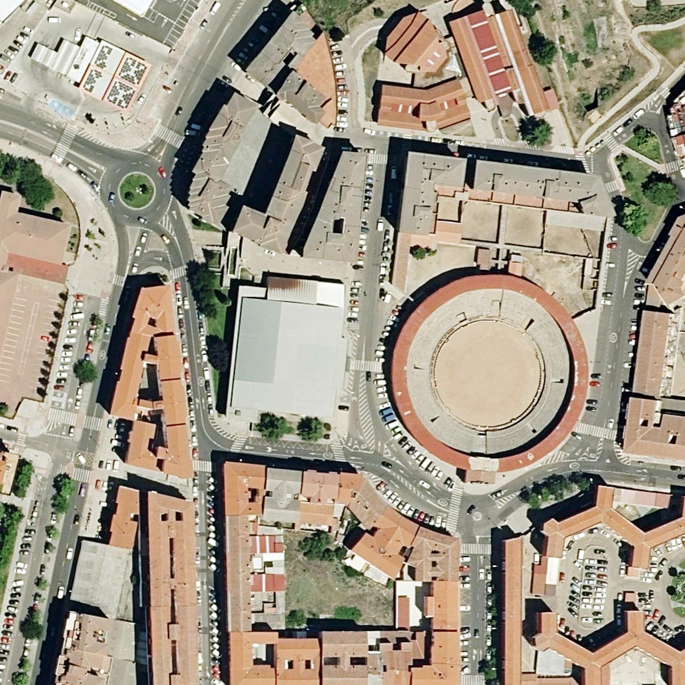

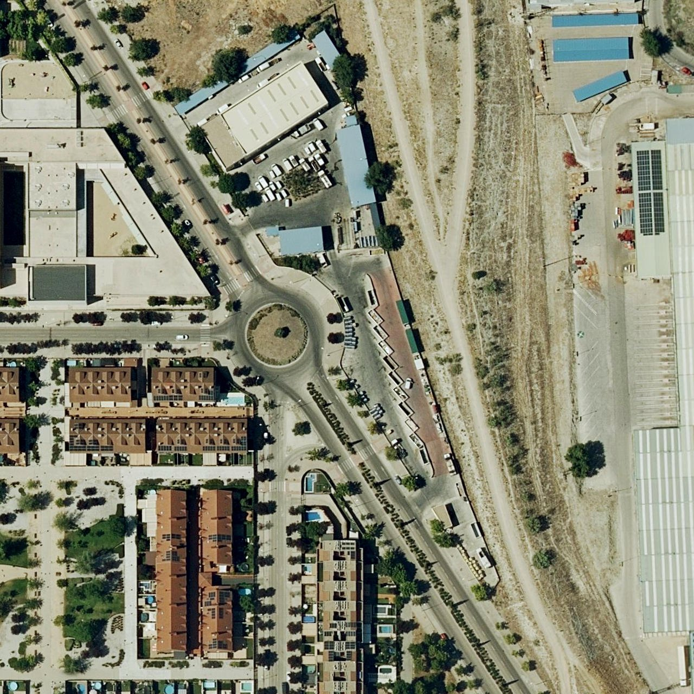

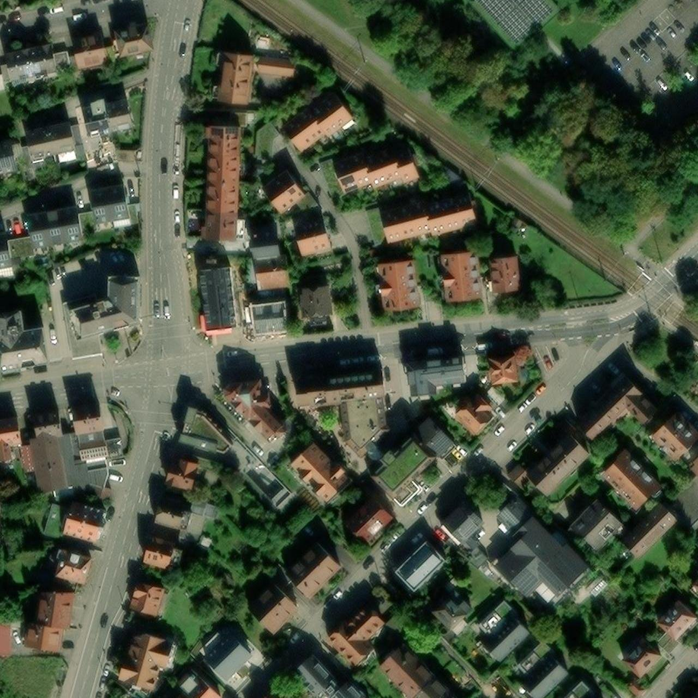

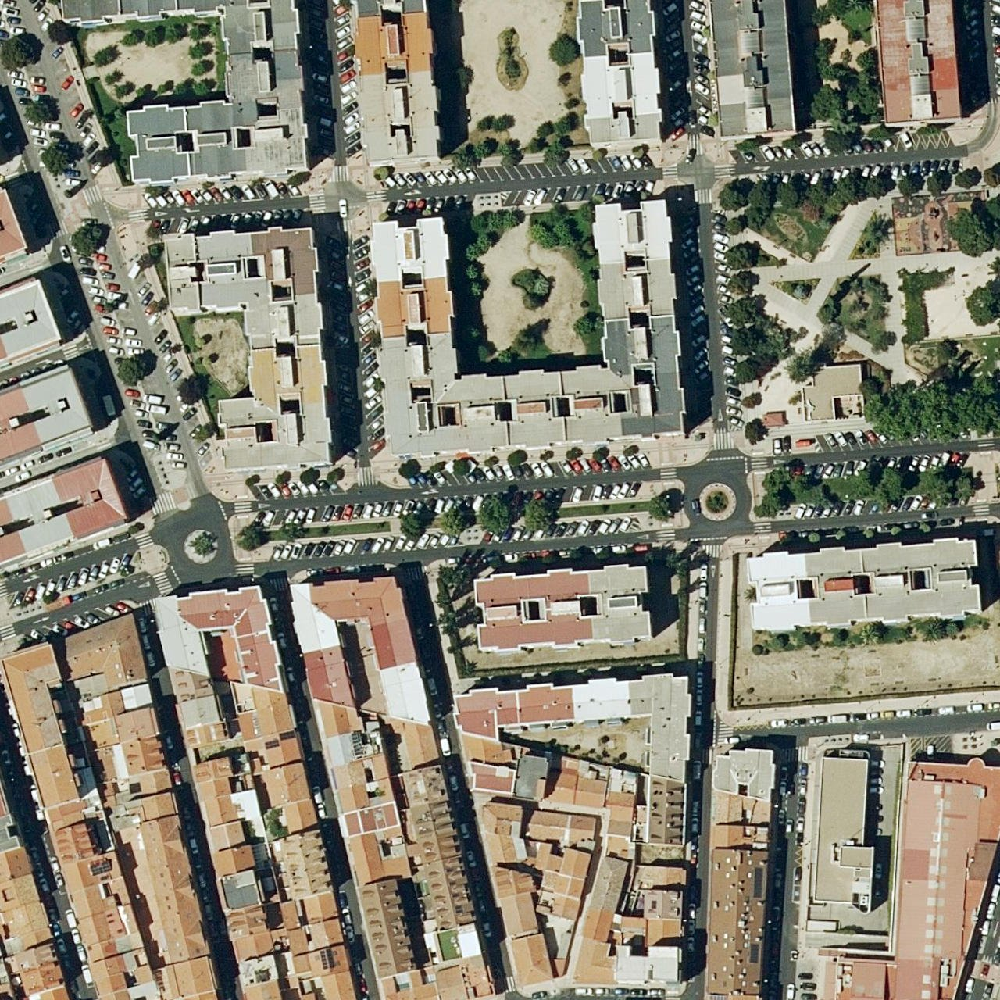

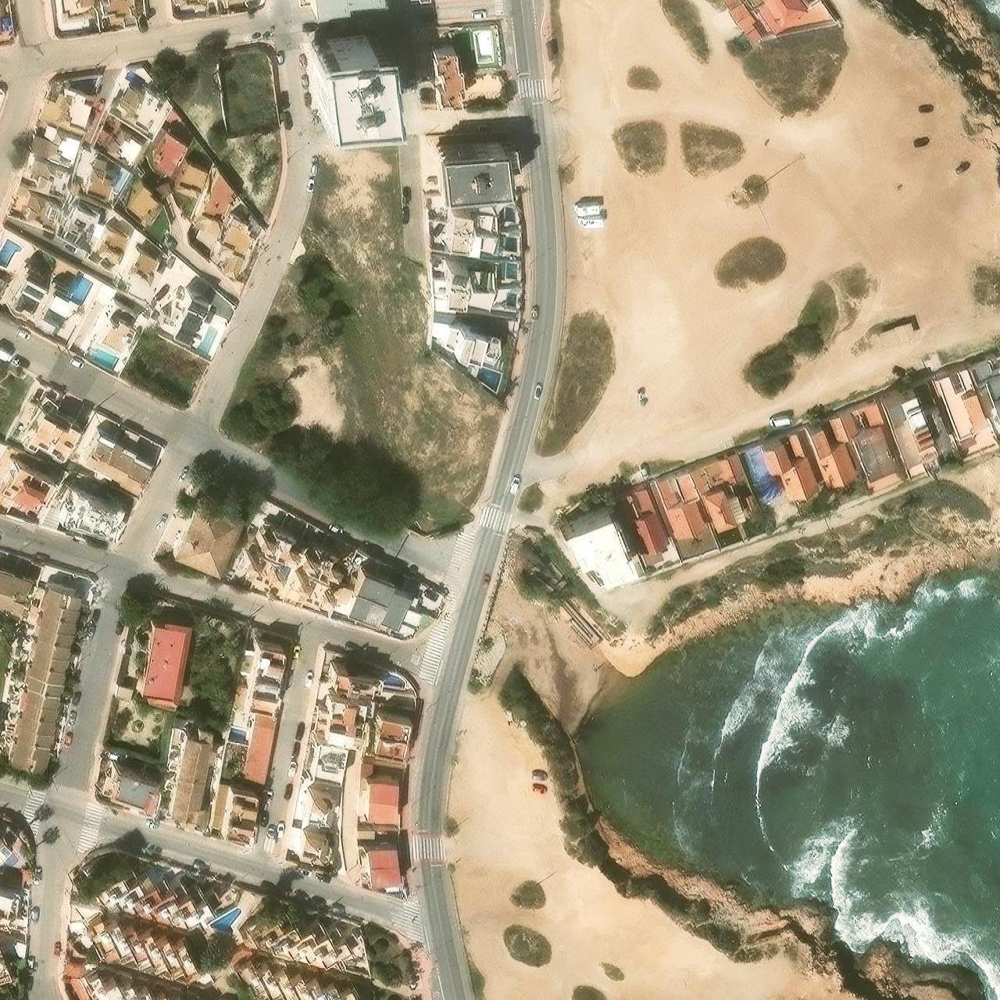

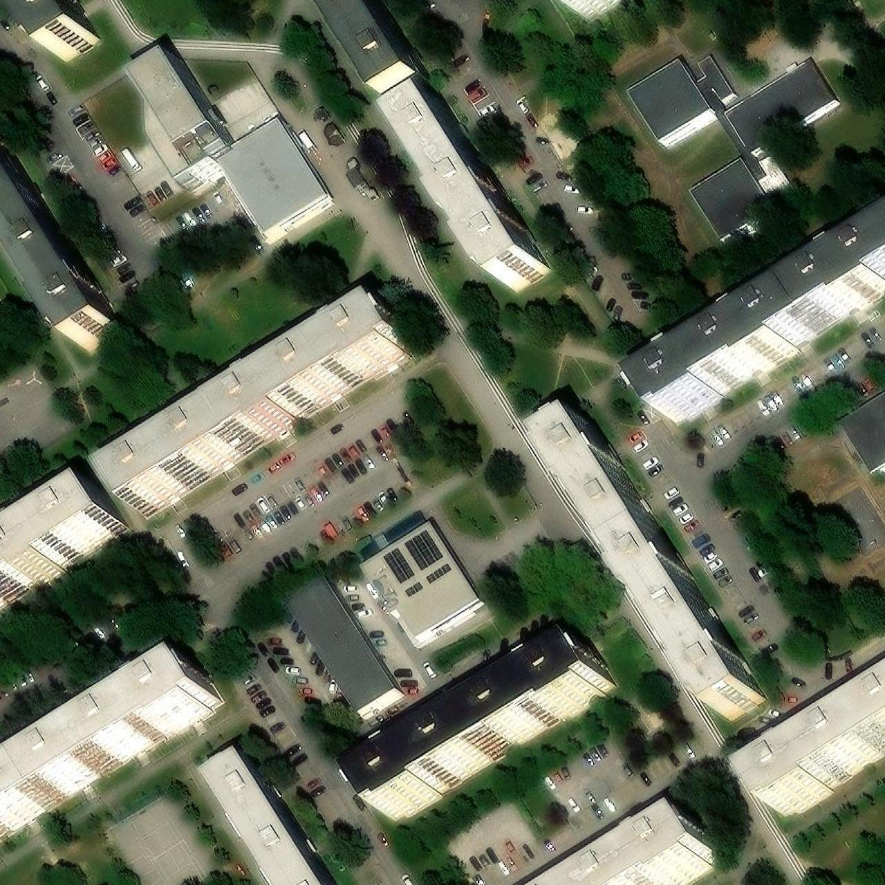

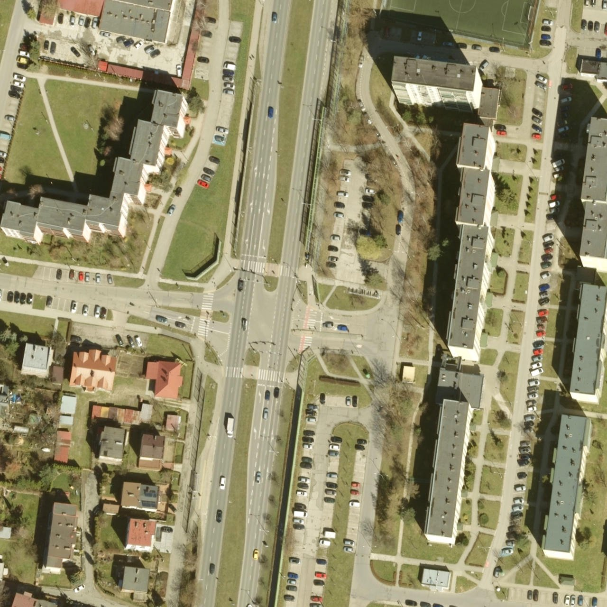

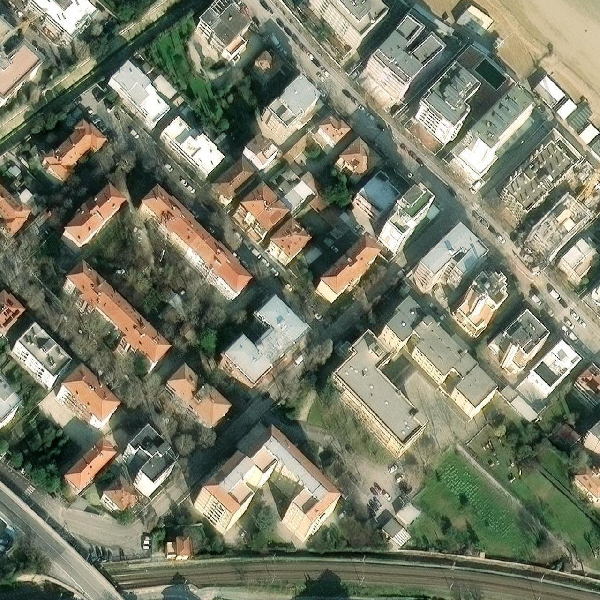

These images show typical urban fabrics for each cluster type, captured at zoom level 18.

