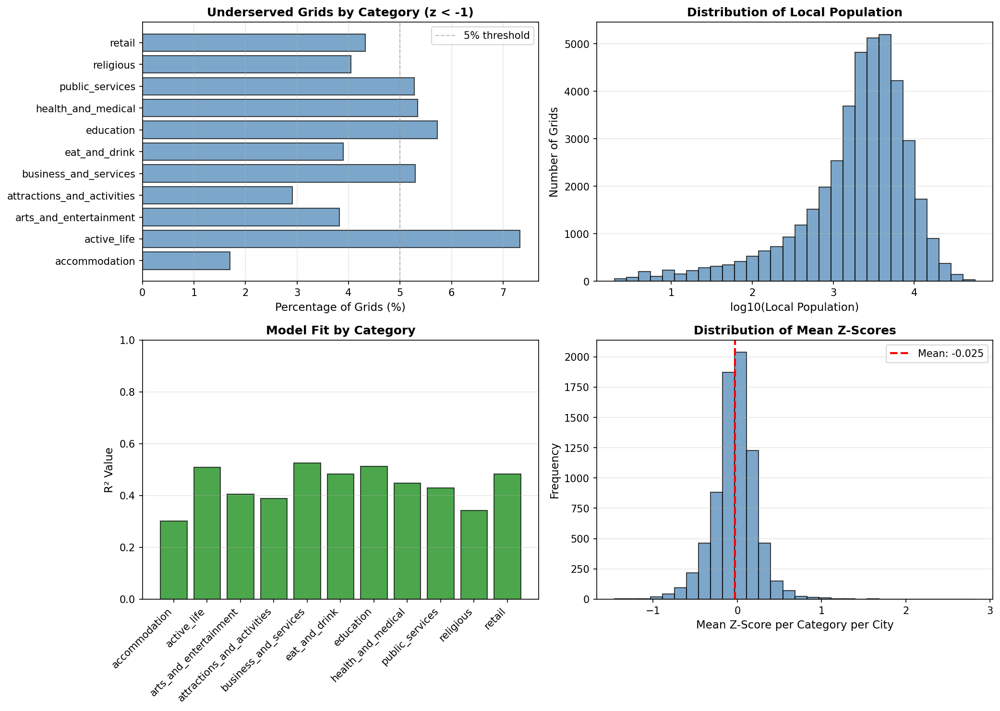
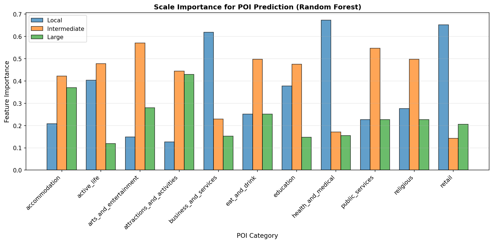
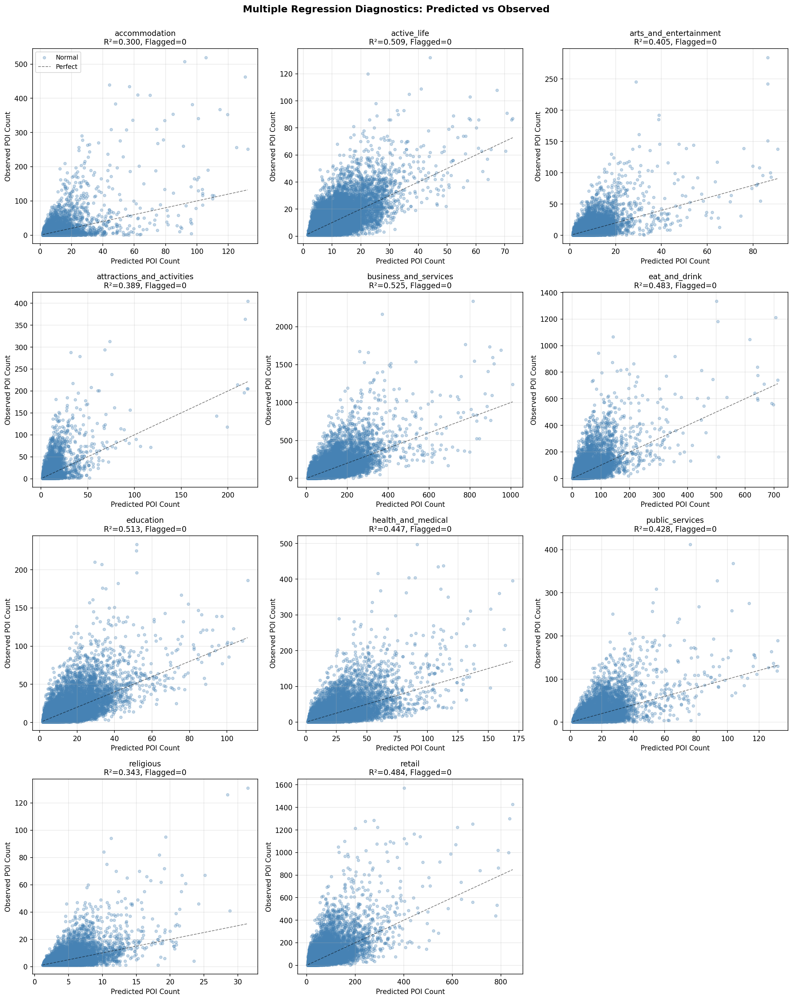

# POI Quality Assessment Report

## Executive Summary

- **Total cities analyzed**: 698
- **Cities with sufficient data** (≥10 grids): 680
- **Total grid cells**: 43038
- **POI categories**: 11

---

## City Rankings

### Most Undersaturated Cities (Lowest Avg Z-Score)

| City | Country | Grids | Avg Z-Score |
|------|---------|-------|-------------|
| Parla | ES | 15 | -1.0426 |
| Vallès Occidental | ES | 25 | -0.8211 |
| Fuenlabrada | ES | 22 | -0.8137 |
| Arganda del Rey | ES | 10 | -0.7513 |
| Torrejón de Ardoz | ES | 18 | -0.6912 |
| Valdemoro | ES | 13 | -0.6143 |
| Brăila | RO | 33 | -0.5877 |
| Gasteizko kuadrilla / Cuadrilla de Vitoria | ES | 33 | -0.5832 |
| Madrid | ES | 450 | -0.5663 |
| Bilbao | ES | 104 | -0.5555 |

### Most Fully Saturated Cities (Highest Avg Z-Score)

| City | Country | Grids | Avg Z-Score |
|------|---------|-------|-------------|
| la Marina Baixa | ES | 26 | 0.3754 |
| Toledo | ES | 17 | 0.3869 |
| Rimini | IT | 41 | 0.3892 |
| Santo António dos Olivais | PT | 22 | 0.3928 |
| Eivissa | ES | 20 | 0.4068 |
| Lecce | IT | 25 | 0.4083 |
| Perugia | IT | 27 | 0.4248 |
| Santiago | ES | 19 | 0.4527 |
| Firenze | IT | 98 | 0.5081 |
| Venezia | IT | 36 | 1.0449 |

---

## Performance by POI Category

### accommodation

- **Avg Z-Score**: -0.0439
- **Min Z-Score**: -0.9930 (Most undersaturated)
- **Max Z-Score**: 2.8207 (Most fully saturated)
- **Std Dev**: 0.2959
- **Cities with data**: 680

**Most undersaturated**: Arganda del Rey, ES (z=-0.9930)
**Most fully saturated**: Venezia, IT (z=2.8207)

### active_life

- **Avg Z-Score**: -0.0275
- **Min Z-Score**: -1.3163 (Most undersaturated)
- **Max Z-Score**: 1.0933 (Most fully saturated)
- **Std Dev**: 0.3082
- **Cities with data**: 680

**Most undersaturated**: Parla, ES (z=-1.3163)
**Most fully saturated**: Winterthur, CH (z=1.0933)

### arts_and_entertainment

- **Avg Z-Score**: -0.0134
- **Min Z-Score**: -0.6856 (Most undersaturated)
- **Max Z-Score**: 0.8436 (Most fully saturated)
- **Std Dev**: 0.1940
- **Cities with data**: 680

**Most undersaturated**: Fuenlabrada, ES (z=-0.6856)
**Most fully saturated**: la Marina Baixa, ES (z=0.8436)

### attractions_and_activities

- **Avg Z-Score**: -0.0281
- **Min Z-Score**: -0.9283 (Most undersaturated)
- **Max Z-Score**: 2.1783 (Most fully saturated)
- **Std Dev**: 0.2311
- **Cities with data**: 680

**Most undersaturated**: Fuenlabrada, ES (z=-0.9283)
**Most fully saturated**: Venezia, IT (z=2.1783)

### business_and_services

- **Avg Z-Score**: -0.0193
- **Min Z-Score**: -1.3233 (Most undersaturated)
- **Max Z-Score**: 0.7886 (Most fully saturated)
- **Std Dev**: 0.2438
- **Cities with data**: 680

**Most undersaturated**: Parla, ES (z=-1.3233)
**Most fully saturated**: Costa del Sol Occidental, ES (z=0.7886)

### eat_and_drink

- **Avg Z-Score**: -0.0163
- **Min Z-Score**: -0.9686 (Most undersaturated)
- **Max Z-Score**: 1.4423 (Most fully saturated)
- **Std Dev**: 0.2214
- **Cities with data**: 680

**Most undersaturated**: Parla, ES (z=-0.9686)
**Most fully saturated**: la Marina Baixa, ES (z=1.4423)

### education

- **Avg Z-Score**: -0.0053
- **Min Z-Score**: -1.4562 (Most undersaturated)
- **Max Z-Score**: 0.9287 (Most fully saturated)
- **Std Dev**: 0.2693
- **Cities with data**: 680

**Most undersaturated**: Parla, ES (z=-1.4562)
**Most fully saturated**: Santiago, ES (z=0.9287)

### health_and_medical

- **Avg Z-Score**: -0.0366
- **Min Z-Score**: -1.3150 (Most undersaturated)
- **Max Z-Score**: 0.7382 (Most fully saturated)
- **Std Dev**: 0.2737
- **Cities with data**: 680

**Most undersaturated**: Parla, ES (z=-1.3150)
**Most fully saturated**: Biel/Bienne, CH (z=0.7382)

### public_services

- **Avg Z-Score**: -0.0295
- **Min Z-Score**: -1.2703 (Most undersaturated)
- **Max Z-Score**: 1.0205 (Most fully saturated)
- **Std Dev**: 0.2802
- **Cities with data**: 680

**Most undersaturated**: Parla, ES (z=-1.2703)
**Most fully saturated**: Bolzano - Bozen, IT (z=1.0205)

### religious

- **Avg Z-Score**: -0.0293
- **Min Z-Score**: -0.8494 (Most undersaturated)
- **Max Z-Score**: 2.3771 (Most fully saturated)
- **Std Dev**: 0.2736
- **Cities with data**: 680

**Most undersaturated**: Vallès Occidental, ES (z=-0.8494)
**Most fully saturated**: Venezia, IT (z=2.3771)

### retail

- **Avg Z-Score**: -0.0163
- **Min Z-Score**: -1.2518 (Most undersaturated)
- **Max Z-Score**: 0.8472 (Most fully saturated)
- **Std Dev**: 0.2172
- **Cities with data**: 680

**Most undersaturated**: Parla, ES (z=-1.2518)
**Most fully saturated**: Venezia, IT (z=0.8472)

---

## Country Summary

| Country | Cities | Total Grids | Avg Z-Score | Min | Max |
|---------|--------|------------|-------------|-----|-----|
| BG | 13 | 482 | -0.2709 | -0.5067 | 0.0130 |
| ES | 106 | 3755 | -0.2213 | -1.0426 | 0.4527 |
| RO | 32 | 1320 | -0.2089 | -0.5877 | 0.1101 |
| PL | 53 | 2942 | -0.0682 | -0.4704 | 0.2436 |
| LT | 4 | 231 | -0.0635 | -0.2766 | 0.1817 |
| FR | 74 | 5916 | -0.0462 | -0.4262 | 0.2227 |
| EE | 3 | 151 | -0.0461 | -0.4108 | 0.1644 |
| GR | 12 | 775 | -0.0318 | -0.2280 | 0.3360 |
| CZ | 16 | 710 | -0.0069 | -0.4496 | 0.3717 |
| PT | 10 | 916 | -0.0027 | -0.3131 | 0.3928 |
| NL | 50 | 2712 | 0.0142 | -0.2198 | 0.1602 |
| LV | 3 | 182 | 0.0199 | -0.2098 | 0.2206 |
| SE | 16 | 1210 | 0.0297 | -0.0989 | 0.1037 |
| HU | 14 | 816 | 0.0408 | -0.1736 | 0.2864 |
| IE | 5 | 599 | 0.0424 | -0.2051 | 0.2442 |
| DE | 108 | 9046 | 0.0578 | -0.3307 | 0.3080 |
| SI | 2 | 111 | 0.0823 | -0.0220 | 0.1866 |
| SK | 7 | 234 | 0.0847 | -0.0354 | 0.3369 |
| IT | 87 | 5478 | 0.0862 | -0.4750 | 1.0449 |
| HR | 5 | 281 | 0.0923 | 0.0599 | 0.1139 |
| BE | 16 | 1082 | 0.0926 | -0.1593 | 0.3745 |
| AT | 8 | 623 | 0.0947 | -0.1198 | 0.2470 |
| DK | 4 | 573 | 0.1062 | 0.0774 | 0.1308 |
| MT | 1 | 101 | 0.1232 | 0.1232 | 0.1232 |
| NO | 3 | 547 | 0.1287 | 0.1016 | 0.1770 |
| FI | 4 | 635 | 0.1412 | 0.1121 | 0.1639 |
| LU | 1 | 69 | 0.1694 | 0.1694 | 0.1694 |
| CY | 3 | 186 | 0.1818 | 0.1479 | 0.2294 |
| CH | 16 | 1072 | 0.2011 | 0.0584 | 0.3584 |

---

## Model Performance by Category

| Category | R² Score | Local Importance | Intermediate Importance | Large Importance |
|----------|----------|------------------|-------------------------|------------------|
| accommodation | 0.3005 | 0.2080 | 0.4215 | 0.3705 |
| active_life | 0.5086 | 0.4035 | 0.4774 | 0.1191 |
| arts_and_entertainment | 0.4051 | 0.1492 | 0.5709 | 0.2799 |
| attractions_and_activities | 0.3888 | 0.1263 | 0.4448 | 0.4289 |
| business_and_services | 0.5246 | 0.6180 | 0.2290 | 0.1530 |
| eat_and_drink | 0.4833 | 0.2520 | 0.4971 | 0.2509 |
| education | 0.5126 | 0.3778 | 0.4751 | 0.1471 |
| health_and_medical | 0.4469 | 0.6732 | 0.1714 | 0.1554 |
| public_services | 0.4283 | 0.2266 | 0.5469 | 0.2264 |
| religious | 0.3428 | 0.2765 | 0.4971 | 0.2264 |
| retail | 0.4836 | 0.6519 | 0.1423 | 0.2058 |

---

## Visualizations

The following visualizations have been generated to support this analysis:

### Exploratory Data Analysis

Key insights:
- Percentage of undersaturated grids by POI category
- Distribution of local population across grids
- Model fit (R²) by category
- Distribution of mean z-scores across cities

### Feature Importance Analysis

Shows which population scale (local, intermediate, large) is most predictive for each POI category.

### Regression Diagnostics

Predicted vs observed POI counts for each category. Shows model fit quality and outliers.

---

## Output Files

### Data Files
- **[grid_multiscale.gpkg](grid_multiscale.gpkg)**:
  Vector grid dataset with z-scores and predictions for all POI categories.
  Contains residuals, z-scores, and model predictions at the grid cell level.
  Can be filtered by z-score thresholds to identify undersaturated/fully saturated areas.

- **[city_results.csv](city_results.csv)**:
  City-level summary statistics with per-category z-score metrics
  (mean, median, std, min, max) for each city.

- **[city_quality_ranking.gpkg](city_quality_ranking.gpkg)**:
  City ranking dataset with geographic boundaries, ranked by average z-score.
  Includes city names, countries, grid counts, and all performance metrics.

### Visualization Files
- **[eda_analysis.png](eda_analysis.png)**:
  Exploratory data analysis showing undersaturation %, population distribution,
  model fit (R²), and z-score distribution.

- **[feature_importance.png](feature_importance.png)**:
  Random Forest feature importance comparing local, intermediate, and large
  population scales across POI categories.

- **[regression_diagnostics.png](regression_diagnostics.png)**:
  Predicted vs observed scatter plots for model diagnostics and fit quality assessment.

---

## Z-Score Interpretation

- **z < 0**: Fewer POIs than predicted (undersaturated)
- **z > 0**: More POIs than predicted (fully saturated)
- **z < -1**: Moderately undersaturated (1 std dev below predicted)
- **z < -2**: Severely undersaturated (2 std devs below predicted)
- **z > 2**: Significantly fully saturated (2 std devs above predicted)
