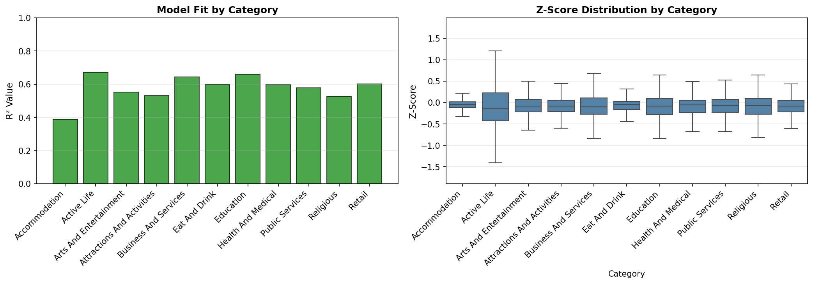
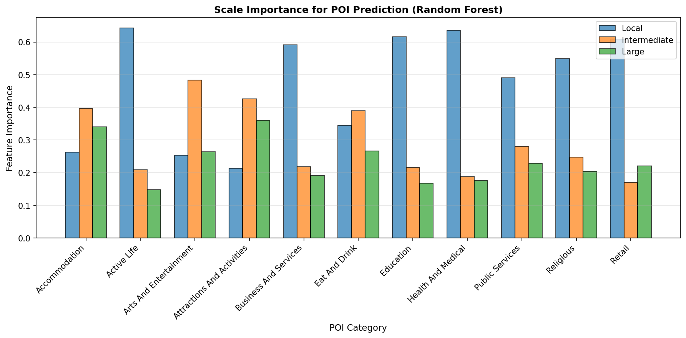
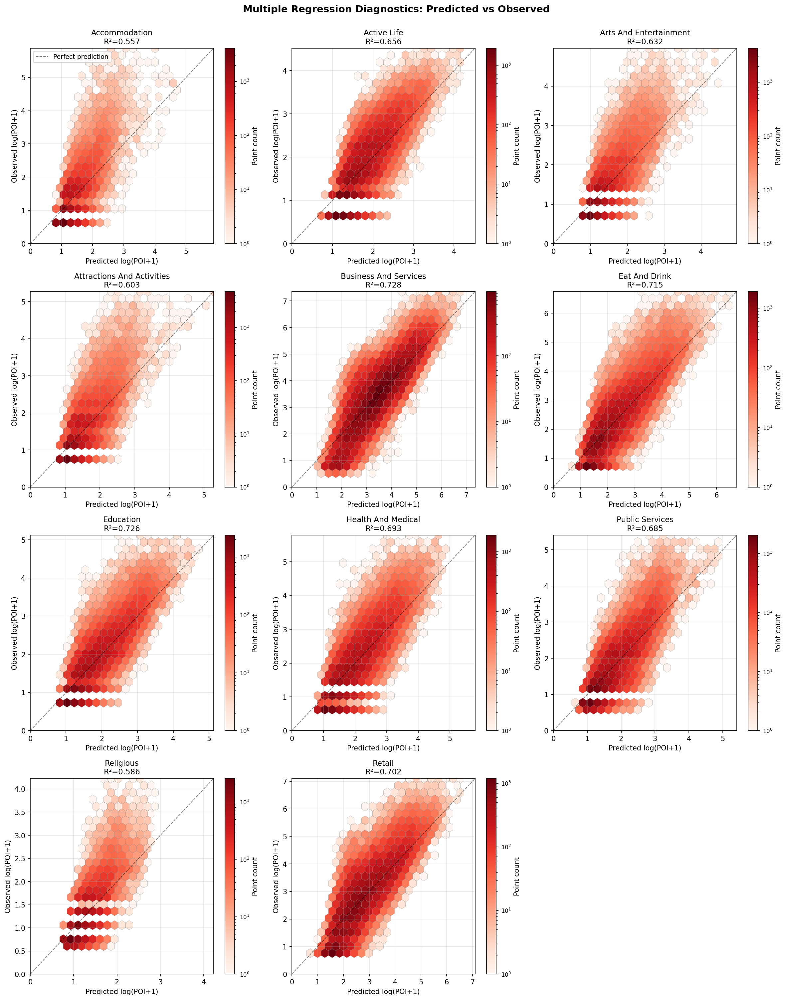
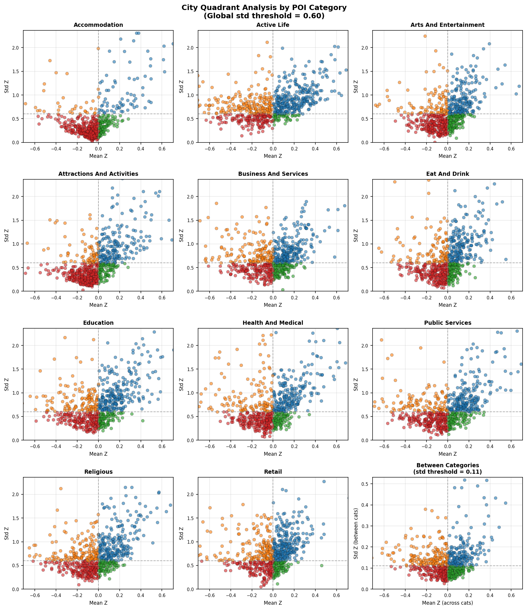

# POI Quality Assessment Report

## Executive Summary

- **Total cities analyzed**: 699
- **Total grid cells**: 43038
- **POI categories**: 11

**Note**: Z-scores represent continuous deviations from expected POI counts.
No arbitrary thresholds are applied. The quadrant analysis identifies cities
based on their mean z-score (saturation level) and variability (consistency).

---

## Z-Score Distribution by Category

| Category | Mean Z | Median Z | Std Z | Min Z | Max Z | N Grids |
|----------|--------|----------|-------|-------|-------|---------|
| Accommodation | 0.000 | -0.045 | 1.000 | -7.287 | 39.038 | 41669 |
| Active Life | -0.000 | -0.148 | 1.000 | -6.006 | 20.291 | 41669 |
| Arts And Entertainment | -0.000 | -0.078 | 1.000 | -9.708 | 38.165 | 41669 |
| Attractions And Activities | -0.000 | -0.085 | 1.000 | -9.677 | 32.920 | 41669 |
| Business And Services | -0.000 | -0.100 | 1.000 | -9.659 | 29.909 | 41669 |
| Eat And Drink | -0.000 | -0.046 | 1.000 | -11.702 | 27.111 | 41669 |
| Education | 0.000 | -0.079 | 1.000 | -5.214 | 24.405 | 41669 |
| Health And Medical | -0.000 | -0.055 | 1.000 | -5.958 | 27.827 | 41669 |
| Public Services | 0.000 | -0.062 | 1.000 | -6.505 | 37.048 | 41669 |
| Religious | -0.000 | -0.075 | 1.000 | -6.736 | 38.040 | 41669 |
| Retail | -0.000 | -0.083 | 1.000 | -9.025 | 27.016 | 41669 |

---

## City Rankings

### Most Undersaturated Cities (Lowest Avg Z-Score)

| City | Country | Grids | Avg Z-Score |
|------|---------|-------|-------------|
| Parla | ES | 15 | -1.0161 |
| Fuenlabrada | ES | 22 | -0.8996 |
| Vallès Occidental | ES | 25 | -0.7188 |
| Torrejón de Ardoz | ES | 18 | -0.6203 |
| Gasteizko kuadrilla / Cuadrilla de Vitoria | ES | 33 | -0.6186 |
| Pinto | ES | 10 | -0.5827 |
| Galați | RO | 35 | -0.5689 |
| Madrid | ES | 450 | -0.5508 |
| Alcalá de Henares | ES | 27 | -0.5345 |
| Bilbao | ES | 104 | -0.5339 |

### Most Saturated Cities (Highest Avg Z-Score)

| City | Country | Grids | Avg Z-Score |
|------|---------|-------|-------------|
| Venezia | IT | 36 | 1.1563 |
| Küsnacht (ZH) | CH | 5 | 0.5451 |
| Firenze | IT | 98 | 0.4841 |
| Eivissa | ES | 20 | 0.4523 |
| Perugia | IT | 27 | 0.4199 |
| Santiago | ES | 19 | 0.4132 |
| Rimini | IT | 41 | 0.4078 |
| Matera | IT | 17 | 0.3987 |
| Santo António dos Olivais | PT | 22 | 0.3861 |
| Toledo | ES | 17 | 0.3853 |

---

## Performance by POI Category

### Accommodation

- **Avg Z-Score**: -0.0077
- **Min Z-Score**: -0.9789 (Most undersaturated)
- **Max Z-Score**: 3.4641 (Most saturated)
- **Std Dev**: 0.3112
- **Cities with data**: 694

**Most undersaturated**: Pinto, ES (z=-0.9789)
**Most saturated**: Venezia, IT (z=3.4641)

### Active Life

- **Avg Z-Score**: -0.0238
- **Min Z-Score**: -1.1644 (Most undersaturated)
- **Max Z-Score**: 1.1640 (Most saturated)
- **Std Dev**: 0.2892
- **Cities with data**: 694

**Most undersaturated**: Fuenlabrada, ES (z=-1.1644)
**Most saturated**: Küsnacht (ZH), CH (z=1.1640)

### Arts And Entertainment

- **Avg Z-Score**: -0.0125
- **Min Z-Score**: -0.6834 (Most undersaturated)
- **Max Z-Score**: 0.7453 (Most saturated)
- **Std Dev**: 0.1746
- **Cities with data**: 694

**Most undersaturated**: Parla, ES (z=-0.6834)
**Most saturated**: la Marina Baixa, ES (z=0.7453)

### Attractions And Activities

- **Avg Z-Score**: -0.0145
- **Min Z-Score**: -0.8329 (Most undersaturated)
- **Max Z-Score**: 2.7855 (Most saturated)
- **Std Dev**: 0.2316
- **Cities with data**: 694

**Most undersaturated**: Madrid, ES (z=-0.8329)
**Most saturated**: Venezia, IT (z=2.7855)

### Business And Services

- **Avg Z-Score**: -0.0211
- **Min Z-Score**: -1.2889 (Most undersaturated)
- **Max Z-Score**: 0.8283 (Most saturated)
- **Std Dev**: 0.2270
- **Cities with data**: 694

**Most undersaturated**: Parla, ES (z=-1.2889)
**Most saturated**: Costa del Sol Occidental, ES (z=0.8283)

### Eat And Drink

- **Avg Z-Score**: -0.0124
- **Min Z-Score**: -1.0762 (Most undersaturated)
- **Max Z-Score**: 1.2816 (Most saturated)
- **Std Dev**: 0.2058
- **Cities with data**: 694

**Most undersaturated**: Fuenlabrada, ES (z=-1.0762)
**Most saturated**: la Marina Baixa, ES (z=1.2816)

### Education

- **Avg Z-Score**: -0.0076
- **Min Z-Score**: -1.4195 (Most undersaturated)
- **Max Z-Score**: 0.8657 (Most saturated)
- **Std Dev**: 0.2394
- **Cities with data**: 694

**Most undersaturated**: Parla, ES (z=-1.4195)
**Most saturated**: Santo António dos Olivais, PT (z=0.8657)

### Health And Medical

- **Avg Z-Score**: -0.0245
- **Min Z-Score**: -1.4554 (Most undersaturated)
- **Max Z-Score**: 1.3418 (Most saturated)
- **Std Dev**: 0.2437
- **Cities with data**: 694

**Most undersaturated**: Parla, ES (z=-1.4554)
**Most saturated**: Küsnacht (ZH), CH (z=1.3418)

### Public Services

- **Avg Z-Score**: -0.0200
- **Min Z-Score**: -1.0157 (Most undersaturated)
- **Max Z-Score**: 0.8822 (Most saturated)
- **Std Dev**: 0.2393
- **Cities with data**: 694

**Most undersaturated**: Parla, ES (z=-1.0157)
**Most saturated**: Perugia, IT (z=0.8822)

### Religious

- **Avg Z-Score**: -0.0127
- **Min Z-Score**: -0.9033 (Most undersaturated)
- **Max Z-Score**: 2.3914 (Most saturated)
- **Std Dev**: 0.2500
- **Cities with data**: 694

**Most undersaturated**: Pinto, ES (z=-0.9033)
**Most saturated**: Venezia, IT (z=2.3914)

### Retail

- **Avg Z-Score**: -0.0202
- **Min Z-Score**: -1.2314 (Most undersaturated)
- **Max Z-Score**: 0.7173 (Most saturated)
- **Std Dev**: 0.1978
- **Cities with data**: 694

**Most undersaturated**: Parla, ES (z=-1.2314)
**Most saturated**: Venezia, IT (z=0.7173)

---

## Country Summary

| Country | Cities | Total Grids | Avg Z-Score | Min | Max |
|---------|--------|------------|-------------|-----|-----|
| BG | 13 | 482 | -0.2266 | -0.4206 | 0.0840 |
| ES | 109 | 3778 | -0.1948 | -1.0161 | 0.4523 |
| RO | 32 | 1320 | -0.1882 | -0.5689 | 0.0607 |
| PL | 54 | 2950 | -0.0569 | -0.3896 | 0.2742 |
| LT | 4 | 231 | -0.0552 | -0.2571 | 0.1442 |
| EE | 3 | 151 | -0.0376 | -0.3162 | 0.1121 |
| FR | 76 | 5925 | -0.0308 | -0.3532 | 0.2338 |
| GR | 13 | 784 | -0.0204 | -0.2250 | 0.3668 |
| CZ | 16 | 710 | 0.0016 | -0.3537 | 0.3397 |
| PT | 12 | 919 | 0.0031 | -0.2271 | 0.3861 |
| LV | 3 | 182 | 0.0284 | -0.1473 | 0.2203 |
| NL | 51 | 2713 | 0.0298 | -0.1881 | 0.1617 |
| SE | 16 | 1210 | 0.0310 | -0.1201 | 0.1170 |
| HU | 14 | 816 | 0.0377 | -0.0959 | 0.3105 |
| IE | 5 | 599 | 0.0473 | -0.1660 | 0.2247 |
| DE | 110 | 9048 | 0.0531 | -0.3021 | 0.2836 |
| SI | 2 | 111 | 0.0558 | -0.0389 | 0.1505 |
| SK | 7 | 234 | 0.0567 | -0.0614 | 0.3041 |
| IT | 87 | 5478 | 0.0827 | -0.3988 | 1.1563 |
| AT | 8 | 623 | 0.0873 | -0.0866 | 0.2113 |
| BE | 16 | 1082 | 0.0977 | -0.1450 | 0.3616 |
| HR | 5 | 281 | 0.1001 | 0.0379 | 0.1737 |
| NO | 3 | 547 | 0.1072 | 0.0826 | 0.1489 |
| FI | 4 | 635 | 0.1214 | 0.1102 | 0.1330 |
| DK | 4 | 573 | 0.1230 | 0.1017 | 0.1453 |
| MT | 1 | 101 | 0.1540 | 0.1540 | 0.1540 |
| CY | 3 | 186 | 0.1589 | 0.1271 | 0.2040 |
| LU | 1 | 69 | 0.1643 | 0.1643 | 0.1643 |
| CH | 17 | 1081 | 0.1944 | 0.0558 | 0.5451 |

---

## Model Performance by Category

| Category | R² Score | Local Importance | Intermediate Importance | Large Importance |
|----------|----------|------------------|-------------------------|------------------|
| Accommodation | 0.3892 | 0.2632 | 0.3970 | 0.3398 |
| Active Life | 0.6727 | 0.6428 | 0.2092 | 0.1480 |
| Arts And Entertainment | 0.5525 | 0.2528 | 0.4828 | 0.2644 |
| Attractions And Activities | 0.5321 | 0.2140 | 0.4254 | 0.3606 |
| Business And Services | 0.6447 | 0.5907 | 0.2181 | 0.1912 |
| Eat And Drink | 0.5998 | 0.3448 | 0.3889 | 0.2663 |
| Education | 0.6598 | 0.6158 | 0.2161 | 0.1681 |
| Health And Medical | 0.5975 | 0.6360 | 0.1882 | 0.1758 |
| Public Services | 0.5789 | 0.4907 | 0.2806 | 0.2287 |
| Religious | 0.5260 | 0.5489 | 0.2475 | 0.2036 |
| Retail | 0.6031 | 0.6093 | 0.1704 | 0.2204 |

---

## Visualizations

The following visualizations have been generated to support this analysis:

### Exploratory Data Analysis

Key insights:
- **Z-Score Distribution**: Distribution of z-scores across grid cells per category
- **Population Distribution**: Distribution of local population across census grid cells
- **Model Fit (R²)**: Model fit quality for each POI category
- **City Z-Score Distribution**: Distribution of mean z-scores across cities

### Feature Importance Analysis

Shows which population scale (local, intermediate, large) is most predictive for each POI category.
Higher values indicate the scale is more important for predicting POI distribution.

### Regression Diagnostics

Predicted vs observed POI counts for each category. Shows model fit quality and outliers.
Points closer to the diagonal line indicate better predictions.

### City Quadrant Analysis

Cities plotted by mean z-score (x-axis) vs variability (y-axis), forming four quadrants:
- **Consistently Undersaturated** (bottom-left): Low POI coverage with uniform pattern
- **Consistently Saturated** (bottom-right): High POI coverage with uniform pattern
- **Variable Undersaturated** (top-left): Low POI coverage with inconsistent pattern
- **Variable Saturated** (top-right): High POI coverage with inconsistent pattern

---

## Output Files

### Data Files
- **grid_multiscale.gpkg**: Vector grid dataset with z-scores and predictions
- **city_analysis_results.gpkg**: City-level z-score statistics and quadrant classification

### Visualization Files
- **eda_analysis.png**: Exploratory data analysis
- **feature_importance.png**: Random Forest feature importance comparison
- **regression_diagnostics.png**: Predicted vs observed plots for all categories
- **city_quadrant_analysis.png**: City quadrant scatter and distribution plot
